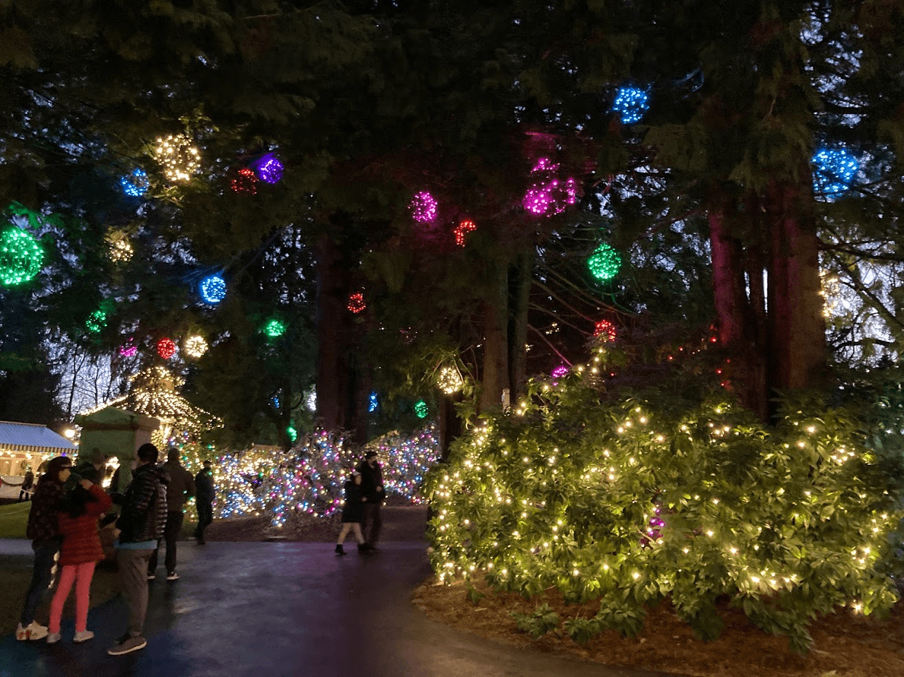

この記事は、「[バンクーバーに移住して8ヶ月が経った](https://chezo.uno/post/2021-12-18-8-months-after-relocating-Vancouver)」のスピンオフである。

「バンクーバーエリア」と書いているのはいわゆるGreater Vancouverと呼ばれる場所に住んでいる（具体的には隣のBurnaby）けどわかりやすいのでそう書いている。（神奈川県民だけど横浜らへんに住んでるという感じのあれ）

## 移住タイミング

日本の学校の年度が切り替わる2021年4月の頭に移住をした。これは学年が変わると諸々大変だろうなと言う思いからそうした。結局、2週間の隔離や家探しをしていたおかげで現地のelementary schoolに通い始めたのが5月の頭で6月末にはこちらの学校が終わってしまったので、慣らし運転という感じになった。

## 子連れ隔離生活

隔離の条件は情勢によって様々変わるだろうが、自分のときは2021年2月に急遽カナダ政府が14日隔離のうち冒頭3日間は政府指定ホテルを確保しろという今思えば一番厳しいときで、バタバタだった。

最初3日間は政府指定ホテルに宿泊、その後別のホテルで11日間宿泊するという流れだった。

教訓としては、窓の開かない部屋で14日間子供と一緒に生活すると、親も子も共に発狂しそうになるということであった。ホテルでは外の空気を吸うことができないのが息苦しく、また子供もちょっとでも退屈になると親を呼び立てるという状況であった。最初のホテルは広くて日当たりも良好だったが、一部屋全部つながっており常に子供と対峙する必要があり気づかれをし、後半のホテルは二部屋あるが一部屋は陽が全く当たらない部屋だったのでテレビを常に付けて明かり代わりにしていた。

事前の対策としては、takuti氏のこのブログを穴が空くほど読みこんでいた。

[【コロナ禍でのカナダ移住】渡航の前後1ヶ月間を振り返る](https://takuti.me/ja/note/one-month-in-canada/)

インスタントの食料なども含めて荷物の輸送には、プラ段とキャリーカートが良かった。

[TRUSCO(トラスコ) ダンボールプラスチックケース 5枚セット A3サイズ 取っ手穴なし 半透明 TDP-A3D-5TM](https://amzn.to/3dT7Ckn)

[EMINENT サイレントキャリーカート 耐荷重40kgタイプ 75-51181](https://amzn.to/3IWopkD)

あと、人間の数以上のPCやiPadを持ち運ぶために、各自リュックを用意して機内に持ち込んだ。

[[ティンバックツー] リュック ザ・ディビジョンパック OS](https://amzn.to/3dSAp8y)

洗濯はホテルの部屋で家族4人分を手洗いするのがなかなかハードだった。元CAのブログなどを読み漁って実際役に立ったのは、セームタオル。洗濯物をこれに包んでシャワースペースで踏むと脱水ができる。めちゃくちゃ吸水して絞ればすぐに乾くので必需品。

[arena(アリーナ) 水泳用 ハイレークセームタオル(L) ARN1640](https://amzn.to/3s9RfYM)

その他、携帯ハンガーと物干しロープを持っていった。ロープはかけるところがあるかどうかは賭けだが、折りたたみハンガーは非常に重宝した。

[携帯ハンガー 10本セット 折りたたみ式 衣類ハンガー 洗濯 物干し 多機能 省スペース 旅行・出張・アウトドアなど ピンチ20個付き](https://amzn.to/3m584R6)

[オーエ 洗濯 物干し ロープ ブルー 約5m ハンガーを掛けられるスリット付 ハンガー ストップ](https://amzn.to/3DYVubW)

エンタメとしては家族で3台のSwitchを持っていき、現地でリングフィットアドベンチャーをやるつもりだったが、荷物預かりの部屋にリングコンを入れっぱなしにしてしまったので、フィットボクシング2を購入した。やはりフィジカルに体を動かすのは非常によく、これを買ってから子供も親も落ち着きが増した。

[Fit Boxing 2 -リズム&エクササイズ- -Switch (【Amazon.co.jp限定】オリジナルリストバンド 同梱)](https://amzn.to/3dX8i89)

薄手のヨガマットはホテル生活にあると運動もストレッチもできるのでかなり便利。

[マンドゥカ(Manduka) エコ スーパーライト トラベル ヨガマット (1.5mm) 20FW ヨガマット 日本正規品](https://amzn.to/3F343nq)

Chromecast with Google TVは、ホテルの無線LANの認証もブラウザ経由で突破できるため、非常に重宝した。これのおかげでNetflixで無限にジブリを子供が見たため、今では僕よりジブリ作品のカバー率が高い。

[Chromecast with Google TV](https://store.google.com/product/chromecast_google_tv?hl=en-GB)

## 家＆学校探し

子連れでの家探しとはすなわち学校探しのことでもある。

市や州にもよって学校の年度の切れ目が違うようだが、[K-12](https://ja.wikipedia.org/wiki/K-12)と呼ばれる期間、幼稚園、elementary school、secondary schoolに通う。子供が通っているelementaryはGrade K,1,...とはじまり7まである。年齢的には日本の1年生がGrade 2になる感じで1 grade上になる。

バンクーバーエリアでは現地の公立小学校（elementary school）に入るしか選択肢はなく（あとはホームスクーリング）、通うとしたらどのあたりの小学校が良いかというのを検討した。

公立のelementary schoolはcatchment areaと呼ばれる学区があり、住む場所が決まると自動的に学校が決まる。ただし、越境通学も教育委員会から許可が下りれば可能らしく、そこはネゴシエーションの世界のようだ。この国は何でもネゴシエーションである。

具体的にはSchool Rankingサイトでスコアが高すぎず低すぎず（以下のサイトで6〜7.5くらい）のところを見つけて、その中でESL率が相対的に高く、Special Neesもそれなりに割合が高く、French Immersionが高くないかを調べた。また、可能であればアジア人の割合も調べた。

[Fraser Institute - School Ranking](https://www.compareschoolrankings.org/)

というのも、

- ESL率が低いとnativeしかおらず英語が全くできないうちの子供への対応が手薄になるであろう
- French Immersionもフランス語に特化していると、いきなり英語とフランス語を同時に習得するのは厳しいだろうしESLへの配慮が薄いかもという危惧
- Special Needsが低いと学校としてそういう子を受け入れない方針だったりする可能性があるだろいうという危惧

を考えていたからである。（実際、別の小学校のKinderに入れようとしたら発達に問題があるかもとか言われて断られたから学区を越えたという話も聞いた）

アジア人の割合が高いと良いと感じているのは、「当たり前」がそれぞれのルーツの数だけあるであろいうという目論見からであった。ランチや各自持ち込むおやつの時間での食べ物に対するいじめや偏見が少ないだろうという予想もあった。実際、韓国のりをおやつに持ち込む子もいて、今までで不評だったのは食べる煮干し（魚の頭が残ってるから？）とナッツ入りのお菓子（ナッツアレルギーの子がいるため）くらいであった。

ちなみに、ランチは学校で注文することもできるが、ピザとかそういう感じなのでおにぎりとおかずを小さい弁当箱に詰めて持たせている。ランチが終わると昼休みは雨でも雪でも外に駆り出されるので、防水の靴や長靴、上から履くレインパンツは必須。

家のタイプは、一軒家、コンドミニアム（いわゆるマンション）、タウンハウス（縦長の長屋スタイル）が主にある。高層階のコンドミニアム以外は基本的に木造で、日本よりも古めの物件が多いことも有り上の階の足音が普通に聞こえる。これは日本では普通やる吸音材などを床下に入れないためらしい。なので、子供の騒音が気になるなら高層のコンドミニアムか（階下に人がいない）タウンハウスが良いかもしれない。こっちに来て驚いたのが一軒家の地下階や二階だけを賃貸に出すというのも多いので、そういうスタイルの場合は騒音トラブルはそれなりにある様子。

なお、家を借りるときは大抵Home Insuranceに入っていることが求められるのだが、同僚などに聞く感じ Square Oneがネットで申し込めて安いのでよく使われている。以下のURLから見積もりをすれば$10の、契約をすれば$25のAmazonギフト券がもらえるのでよければ使ってみてほしい。

[https://www.squareone.ca/ref/UQUSE5](https://www.squareone.ca/ref/UQUSE5)

あと、家を借りるときは半月分のSecurity Depositを払うなどまとまったお金がいるので、もしカナダの銀行にお金が入っていなければ、Wiseを使って日本から送金するとよいだろう。以下のリンクから申し込みをしてくれると手数料も無料になるクーポンが発行される。

[Wise: Online Money Transfers | International Banking Features](https://wise.com/invite/ih/michiakia)

なお、BC州ではドライバーズライセンスを手に入れる時に日本の免許証を渡さないといけないのだが、Wiseの初回送金は本人確認で住所記載欄のある古いパスポートか免許証が必要なため、試しに一度送金しておくと良いだろう。（でないと、パスポート更新で詰む）

## 英語

子供によって合う合わないがあるので、一概には言えないのだが、我が家の場合はラッキーなことに移住から8ヶ月経った今は子どもたちは英語にかなり慣れてきている。

我が家の場合、新学年がはじまったばかりの9月くらいまでは学校行きたくないと泣きわめくことも多かったが、年度が変わるとELLと呼ばれる英語初学者向けの授業などサポートが安定し、また学校の校庭が公園になっており、そこで遊ぶ友達も何人かできたためぐんぐん吸収している。

日本では、特段英会話の教育を熱心にしていたわけでもない。妻が[セサミストリート](https://www.youtube.com/channel/UCoookXUzPciGrEZEXmh4Jjg)や[Alphablocks](https://www.youtube.com/channel/UC_qs3c0ehDvZkbiEbOj6Drg)の動画をYouTubeやNetflixで見せていた程度だ。

セサミストリートは、主に文化面での多様性に関する話がふんだんに出てくるのがよく、色んな国のlunchの話だったりが出てきてこちらの学校に移ってもすんなり受け入れることができたと思う。

Alphablocksはいわゆるフォニックスのルールをキャラクター化されたアルファベットと一緒に学べるのでおすすめ。

なお、妻は英語には抵抗はなく学校の他の保護者との会話も妻のほうが良くしているので、そこは楽をさせてもらっている。（怪しい人じゃないと主張するためにお天気会話をすべきとよく言われる）

## 医療費と健康保険

カナダは健康保険については国民皆保険（MSPと呼ばれるプランに入る）なので、病気や怪我など病院での治療は基本無料で受けられる。ただし、歯科や眼科はお金がかかる。視力検査は子供は年に一回まで無料なので、学校で視力検査がない代わりに自分で行く必要がある。

MSPについて子供は、study permitを持っている場合international student扱いになり、BC州ではMSPのお金として月に75ドルかかるので注意が必要。永住権を取れればこれが不要になるので結構大きい。

## 教育資金の積立

カナダは、子供の教育資金の積立にRESP (Registered Education Savings Plan）というものがある。これを使うと拠出金額の20%マッチングしてくれたり、税制上の優遇がある。BC州は9歳までに申し込むと[1200ドルも州からもらうことができる](https://www2.gov.bc.ca/gov/content/education-training/k-12/support/scholarships/bc-training-and-education-savings-grant)。

[カナダの子供の教育貯蓄プラン（RESP）は、魅力が盛り沢山！ | カナダに住もう](https://canadanisumo.com/277/)

なんだけど、study permitだとSINと呼ばれるマイナンバーのようなもの（税金を払うための番号）が子供に発行できないので、永住権を待たないといけない。

なお、RESPの他にもRRSPやTFSAなど子供には関係のない税制優遇されている投資口座があるので興味があれば調べてみると良い。

## 子供向けのイベントがたくさんある

自然が豊かなカナダなので、ハイキングやらバイクパークやら楽しむことは色々ある。そして、北米ではよくあるイベントとして、パンプキンパッチと呼ばれるハロウィンのかぼちゃを農場に行って拾ってきたり、いちご狩りも一大イベントである。クリスマスツリーを買ってきて飾り付けなんかもする。

Michaelsと呼ばれる、creative系のあれこれが安く売ってるお店に行けば、絵の具やらオーナメントやら色々手に入るので、創作が好きな子供にはぴったりだろう。

クリスマスは一大イベントで、街中が飾り付けされている。

学校でも、今日はXXデーなので、何色の服を来てきてください、とかパジャマデーなのでパジャマで投稿してねとか色々ある。色指定の服はMichaelsで様々な色のシンプルなTシャツが売ってるのでそれで済ませるとよい。

## 習い事

市のスポーツセンターでは、水泳教室やスケート教室が安く開催される(水泳教室は$3以下で8週)ので、皆それに行かせるのが多いよう。友人のお家では空手教室に通ってたりすると聞く。

厄介なのが、水泳教室の募集開始時は一斉にウェブで予約するので、複数端末からアクセスして予約合戦を繰り広げる必要があるところ。

スケート教室なんかは少し遠いところで開催されたりするので、住んでる場所にもよるが車があったほうが送り迎えはしやすい。けど、バンクーバー近辺は北米で最も優れた公共交通機関とも評されたTransLinkが運用する鉄道やバスがある（酷い遅延はあまりなく、バスは予定より早く通り過ぎることもある！）ため、住む場所によってはそれらも使いこなせるだろう。

[おめでとう！バンクーバーのTransLink が「北米で最も優れた公共交通機関」に選出!](https://lifevancouver.jp/2019/07/news/159240.html)

## 日用品の買い物

子供の服や文房具などの消耗品は、Metrotown駅にあるカナダで二番目に大きいモールのMetropolisに買いに行く。ユニクロも無印もZaraもH&Mもなんでもある。消耗品はWalmartにいけばいいし、日本の文房具をメインに扱うお店もある。

防水のジャケットやブーツは、Mountain Warehouseというカナダのモンベルが安くて品質もそれなりに良いのでそこで買っている。やはり、ブラックフライデーが一年で一番安いようだが、もともとはカナダにはブラックフライデーの文化はなく、Common Wealthの国として12/26のUnboxing dayがセールの時期だったらしい。

ちなみに、北米は返品文化と言われるが、Amazonで頼んだものが既に壊れてるとか動かないみたいなのは日常茶飯事なので、返品がカジュアルに行わているという実感。

そうそう、Amazonで思い出したが、日本の感覚でAmazonで買い物をするとたまに混乱することがある。例えば、東海岸から発送されるので1週間くらい平気でかかることもある、とかPrimeマークついてるからと油断すると、アメリカや日本から届いて1-2週間かかるとか。広大な国土を持つと輸送には時間がかかるんだなあと思わされる。

なお、PCやデジタルガジェット系は日本より入手が非常に難易度が高く、中国系の製品がアメリカでは売ってるけどカナダでは売ってないということも多いので、必要であれば日本で買うのが良い。

## 8ヶ月目での所感

学校が一クラス20人しかおらず、授業も日本よりも自由にのびのびとやる感じ（教科書も配布されないし先生の裁量次第）みたいなのもあって、こちらの生活に想像以上に馴染んでいる様子。日本の学校ではCOVID-19後、様々なトラブルがあったのだが、カナダの先生はメールで困りごとを連絡するとさっと対策をしてくれたりするので非常に助かっている。

このまま大きな問題もなく成長してくれることを願うが、おそらく学校とのタフなネゴシエーションはどこかで発生するだろうという心づもりで生活をしている。

---

記事が気に入ったらbuymeacoffeeでサポートしていただけると嬉しいです

[chezou is a podcaster and technical blogger and open source developer](https://www.buymeacoffee.com/chezou)

---

[Back to home](https://memo.chezo.uno/)