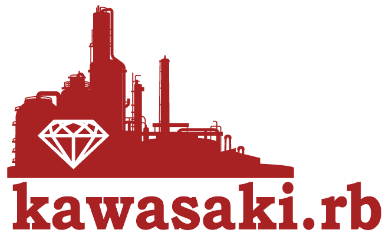

これは、kawasaki.rb 10周年突入LT大会に際して、kawasaki.rbの9年の振り返りです。

[kawasaki.rb #109 10周年突入LT大会 (オンライン開催) (2022/06/25 12:00〜)](https://kawasakirb.connpass.com/event/250519/)

もともとは、これの話をする予定でした。

[4 Steps to Release a CLI in Python | Democratizing Data](https://chezo.uno/blog/2022-05-21_fastest-way-to-release-python-cli/)

## 第一回開催 (2013)

[Kawasaki.rb #001 第1回ミートアップを開催しました #kwskrb | Democratizing Data](https://chezo.uno/post/2013-06-29-kawasaki-dot-rb-number-001-di-1hui-mitoatupuwokai-cui-simasita-number-kwskrb/)

初回からPythonの話だったりRubyコミッタによるC言語とGCの話だったり、多様な言語の様子が見て取れますね。これは狙っていたところでもあり、言語非依存なRubyコミュニティというある意味矛盾した存在意義を打ち立てるのに成功したのかな、と思います。

元々は、asakusa.rbちょっと~~ガチで近寄りがたい~~みたいなところもあり緩い場として始めましたが、まあ結果オーライということで。

## 迷走期 (第2～6回)

ミューザ川崎の会議室で定期開催するかと思いきや、隔月で居酒屋でLTをするという企画をしていました。焼肉しながらLTするというハードな企画ものもありました。

[https://twitter.com/gotoken/status/360018779784237056?s=20&t=aDr096NoL5UBE8QZrmBLkg](https://twitter.com/gotoken/status/360018779784237056?s=20&t=aDr096NoL5UBE8QZrmBLkg)

## 第7回 NTT-ATさんの会議室で安住の地を得る (2014)

[kawasaki.rb #007 を開催しました #kwskrb | Democratizing Data](https://chezo.uno/post/2014-01-24-kawasaki-dot-rb-number-007-wokai-cui-simasita-number-kwskrb/)

長い間お世話になっていた、NTT-ATさんの会議室で開催することができました。

なお、NTT-ATさんの関係者の方々に教えてもらって、川崎駅の[狸小路飯店](https://www.instagram.com/p/CeqRH3sNrl6/)で懇親会を開催するようになり、紹興酒が定番のお酒になりました。これが、オンライン懇親会も仮想狸で行われるようになった所以です。

## 第8回 パーフェクトRuby読書会をはじめる (2014)

[kawasaki.rb #008 を開催しました #kwskrb | Democratizing Data](https://chezo.uno/post/2014-01-24-kawasaki-dot-rb-number-008-wokai-cui-simasita-number-kwskrb/)

yokohama.rbでの読書会をヒントに、楽して安定的に開催をする方法を獲得します。それまでは、主催者がLTの登壇者を一生懸命募り、なさそうなら自分が発表するというストロングスタイルをしていたのですが、この時から安定して開催する目途が立ちました。

音読してライブコーディングをしながら突っ込むというスタイルは、賛否両論あるかとは思いますが、主催側にとっては福音でした。

しかし、ツッコミながら読み進めるスタイルは、深く突っ込んだ議論ができる反面、一回で1ページも進まない事態も生み出すのでした。

## Ruby Kaja (2014)

[Ruby Kaja](http://web.archive.org/web/20160613070027/http://kaja.rubyist.net/2014/kaja)

Ruby Hirobaというイベントでコミュニティの貢献者を表彰するという取り組みがありました。この当時の地域Rubyコミュニティの数の多さがうかがい知れます。

## 第18回 N周年 LT大会を発明する (2014)

[kawasaki.rb #018 LT大会を開催しました #kwskrb](http://kawasakirb.github.io/kawasakirb/2014/11/27/kawasakirb-018-kwskrb)

今でこそ定番になったN周年記念LT大会が始まりました。これは日本で一二を争う緩さのLT大会として有名で、スライドを東海道線でiPhoneで作る人や、ブログで話す人、果ては手ぶらで写真だけで話し始める人など様々でした。

LT大会を重ねていくと様々な報告も受けることになりました。

[https://twitter.com/chezou/status/758256387415678976?s=20&t=iP5dZw0-PZ2nTNL_Q6xceg](https://twitter.com/chezou/status/758256387415678976?s=20&t=iP5dZw0-PZ2nTNL_Q6xceg)

## 神奈川 Ruby 会議 01 (2015)

[RegionalRubyKaigi レポート (49) 神奈川 Ruby 会議 01](https://magazine.rubyist.net/articles/0050/0050-KanagawaRubyKaigi01Report.html)

yokohama.rbさんと共同で初めての地域Ruby会議を行いました。ペアプロ大会は、出題を鍋谷さんにお願いして企画しましたが、ほかにないもので盛り上がりました。

初心者からコアな人まで楽しめるようにと、エモい回にしたのですが、あとから歴史を振り返ってみるとRubyConfなどのエモさからコアな内容に振ったRubyKaigiへの流れに逆行していましたね。まあ、無知というのはある時何かを生み出すこともあります。

## 川崎 Ruby 会議 01 (2016)

[RegionalRubyKaigi レポート (60) 川崎 Ruby 会議 01](https://magazine.rubyist.net/articles/0055/0055-KawasakiRubyKaigi01Report.html)

名前は変わりましたが2年連続で地域Ruby会議を開催していました。よく考えるとすごい。

mameさんの基調講演Rubyによるファミコンエミュレータの話に始まり、C#、Scala、Roomba、Rails、サーバレスの話など多岐にわたるテーマでした。

主催者打ち上げで、松田さんが紹興酒をカメでたのんだり、二次会のハードロック居酒屋の思い出が懐かしいです。

## 第47回 ミューザ川崎に戻る (2017)

[kawasaki.rb #047 (2017/04/26 19:15〜)](https://kawasakirb.connpass.com/event/55002/)

諸般の事情から、NTT-ATさんの会議室からミューザ川崎へと拠点を移しました。移転してしばらくしたらWiFiも使えるようになって、電源もプロジェクターも借りられていたのでなかなか良い環境になっていました。

## 第49回 joker1007さんによるサイン＆じゃんけん大会が行われる (2017)

kawasaki.rbはその~~遅い~~長い読書会によって、パーフェクトRubyの売り上げに結構貢献したという自負を持っており、ついに著者の一人であるjoker1007さんが乗り込んできていただいて、サイン本のじゃんけん大会がありました。

[kawasaki.rb #049を開催しました #kwskrb](https://medium.com/kawasakirb/kawasaki-rb-049%E3%82%92%E9%96%8B%E5%82%AC%E3%81%97%E3%81%BE%E3%81%97%E3%81%9F-kwskrb-72b2bcdcbbaa)

[https://twitter.com/koooge/status/880038547268317184](https://twitter.com/koooge/status/880038547268317184)

## 第82回 After COVID-19の時代 (2020)

[kawasaki.rb #082 (オンライン開催)を開催しました #kwskrb](https://medium.com/kawasakirb/kawasaki-rb-082-%E3%82%AA%E3%83%B3%E3%83%A9%E3%82%A4%E3%83%B3%E9%96%8B%E5%82%AC-%E3%82%92%E9%96%8B%E5%82%AC%E3%81%97%E3%81%BE%E3%81%97%E3%81%9F-kwskrb-8881880b336f)

さくっとDiscordで開催をすることで、COVID-19の広がりにも対応してきました。

しかし、kishimaさんの自作ハード/ファーム/ソフト Family mrubyによるテトリスデモは、リモートとは思わせない熱いプレゼンでした。

## 第89回 パーフェクトRuby読書会が終わる (2020)

2014年1月に開始したパーフェクトRuby読書会。ようやくその幕を下ろしました。

[https://twitter.com/kishima/status/1321418991487705089](https://twitter.com/kishima/status/1321418991487705089)

進みが遅いのが有名で読み終わったのは [2020年10月の回](https://medium.com/kawasakirb/kawasaki-rb-089-%E3%82%AA%E3%83%B3%E3%83%A9%E3%82%A4%E3%83%B3%E9%96%8B%E5%82%AC-%E3%82%92%E9%96%8B%E5%82%AC%E3%81%97%E3%81%BE%E3%81%97%E3%81%9F-kwskrb-30e501d801c1)でした。丸6年10か月も読み進める間に第二版も出ていたのでした。

## 第93回 プロと読み解く**Ruby 3.x NEWS を読み始める**

パーフェクトRubyの後継として、プロと読み解くRuby 3.0 NEWSを読み始めました。Rubyの最新版についにキャッチアップできるとなって、皆でツッコミながら噛みしめています。

[kawasaki.rb #093 (オンライン開催)を開催しました #kwskrb](https://medium.com/kawasakirb/kawasaki-rb-093-%E3%82%AA%E3%83%B3%E3%83%A9%E3%82%A4%E3%83%B3%E9%96%8B%E5%82%AC-%E3%82%92%E9%96%8B%E5%82%AC%E3%81%97%E3%81%BE%E3%81%97%E3%81%9F-kwskrb-8446ad49192a)

## kishimaさん、Ruby Kaigiに登壇 (2020)

[RubyKaigi Takeout 2020](https://rubykaigi.org/2020-takeout/presentations/kishima.html)

kawasaki.rbにもよく参加していただいているkishimaさんが、上述のFamiry mruby の話でRuby Kaigiに登壇されました。別にkawasaki.rbが特別何かをしたわけではないんですが、感慨深い思いでした。（多分コミッター以外の参加者から初登壇？）

## 第95回 創設者、海外逃亡したってよ (2021)

2021年4月から、ファウンダーのchezouが海外に~~逃亡~~移住したため、ブログ係としてもずっと貢献していただいていたperanikovさんを中心とした皆さんにバトンタッチをしました。

chezouは毎年節目のLT大会に顔を出すだけのおじさんになってしまいましたが、粘り強く続けていただいて感謝です。

[kawasaki.rb #097 9年目突入LT大会 (オンライン) を開催しました #kwskrb](https://medium.com/kawasakirb/kawasaki-rb-097-9%E5%B9%B4%E7%9B%AE%E7%AA%81%E5%85%A5lt%E5%A4%A7%E4%BC%9A-%E3%82%AA%E3%83%B3%E3%83%A9%E3%82%A4%E3%83%B3-%E3%82%92%E9%96%8B%E5%82%AC%E3%81%97%E3%81%BE%E3%81%97%E3%81%9F-kwskrb-3dff472c6e6c)

しかし、こんな雑な振りでなんとか回していただいていてありがとうございます。

## 9年を振り返って

この記事にも書いたのですが、言語非依存な技術系地域コミュニティとして、地理的特性を生かしたkawasaki.rbははじまりました。

[言語agnosticな技術系地域コミュニティを続けるということ](https://medium.com/kawasakirb/%E8%A8%80%E8%AA%9Eagnostic%E3%81%AA%E6%8A%80%E8%A1%93%E7%B3%BB%E5%9C%B0%E5%9F%9F%E3%82%B3%E3%83%9F%E3%83%A5%E3%83%8B%E3%83%86%E3%82%A3%E3%82%92%E7%B6%9A%E3%81%91%E3%82%8B%E3%81%A8%E3%81%84%E3%81%86%E3%81%93%E3%81%A8-3754e4723785)

これは、kawasaki.rbが拠点とする南武線沿線には電機メーカーが多く工場を構えており、東京都心のスタートアップやいわゆるウェブ系の会社よりもお堅い会社が多かったのでした。

[https://twitter.com/stuka_gf/status/890026458445340673](https://twitter.com/stuka_gf/status/890026458445340673)

また、始めた当時は「ウェブ系vsエンプラ」「Ruby vs (エンタープライズ）Java」といった対立構造もよくあおられており、「仕事でRubyを書きたい」みたいな人も多かったように思います。今となってはこの対立構造自体も懐かしいですね。

かくいう私自身も、一社目の年配社員に「休日もコード書いてるの？え、まじで？」と言われて、もっと気軽に技術のことについて話したいなぁと思ったことがあり、テックな話の出来る場所としてありがたい存在でした。

その後、時代が進むにつれて、Rubyだけではない地域Rubyコミュニティが表れてきているのが観測されています。やはり、地方では技術コミュニティがそもそも希少なことが大きいのだと思います。業務後にカジュアルに技術の話をできる場所、エンジニア同士の話ができる場所というのは貴重ですね。筆者が顔を出している[某社会人サークル](https://qiita.com/atusi/items/fc5f117652e6979fd813)も似たような効用を発揮しています。

[https://twitter.com/chezou/status/1297129292338323456?s=20&t=byIhUpoOyowyRRJEvuuVMw](https://twitter.com/chezou/status/1297129292338323456?s=20&t=byIhUpoOyowyRRJEvuuVMw)

しかし、COVID-19以降オンライン開催されるようになったことは、善し悪しがありました。遠隔地から気軽に参加できるようになった反面、日本全国のコミュニティとしのぎを削って認知を獲得するという意味ではなかなか大変だなあと感じています。

地域Ruby会議を開催していた時は、やれば認知を獲得できて新規参入を得られるというのがわかっていたのですが、主催のコストはなかなか高く、LT大会を毎年開催するという形に今は落ち着いています。

他にやっていてよかったこととしては、会の開催を省力化して惰性で開催できるようにしておいたことです。これにより、引継ぎのコストが比較的抑えられたのではないかと思います（主観でしかないですが）。

今後もkawasaki.rbの10年目が盛り上がって、ゆるゆると次の10年も進めていけることを楽しみにしています。

## おまけ: kawasaki.rbの人気言語は何か？

第1回からのchezouによる[根性マイニング](https://www.hottolink.co.jp/column/20210517_109053/#:~:text=%E4%BA%BA%E3%81%AE%E7%9B%AE%E3%81%A7%E6%8A%95%E7%A8%BF%E3%82%921%E4%BB%B6%E3%81%9A%E3%81%A4%E7%A2%BA%E8%AA%8D%E3%81%97%E3%81%A6%E3%81%84%E3%81%8F%E5%BF%85%E8%A6%81%E3%81%8C%E3%81%82%E3%82%8A%E3%81%BE%E3%81%99%E3%80%82%E6%88%91%E3%80%85%E3%81%AF%E3%81%9D%E3%82%8C%E3%82%92%E3%80%81%E3%80%8C%E6%A0%B9%E6%80%A7%E3%83%9E%E3%82%A4%E3%83%8B%E3%83%B3%E3%82%B0%E3%80%8D%E3%81%A8%E5%91%BC%E3%82%93%E3%81%A7%E3%81%84%E3%81%BE%E3%81%99%EF%BC%88%E7%AC%91%EF%BC%89%E3%80%82)の結果、人気の言語（？）をランキングしてみました。

[https://docs.google.com/spreadsheets/d/1tvedofMdYx3n7wBjY_F9hapsqivwrRE9uftDCj4iUpg/edit?usp=sharing](https://docs.google.com/spreadsheets/d/1tvedofMdYx3n7wBjY_F9hapsqivwrRE9uftDCj4iUpg/edit?usp=sharing)

一番人気の言語はRubyでした。ダントツですね。二位はPython、三位はGoでした。

?はどういれればいいんだろうという悩ましいものを入れています。ふんどしとかね。気になる人は元のスプレッドシートを見てください。

---

記事が気に入ったらbuymeacoffeeでサポートしていただけると嬉しいです

[chezou is a podcaster and technical blogger and open source developer](https://www.buymeacoffee.com/chezou)

---

[Back to home](https://memo.chezo.uno/)
