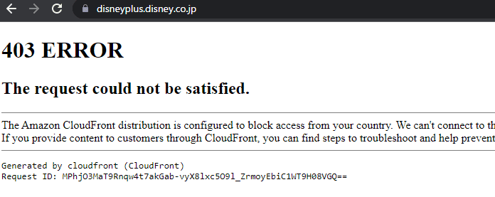

これは[pyspaアドベントカレンダー2022](https://adventar.org/calendars/7432)の6日目の記事です。

昨日は [katzchang](https://twitter.com/katzchang) さんでした。

さて、[おま国](https://dic.nicovideo.jp/a/%E3%81%8A%E3%81%BE%E5%9B%BD)と呼ばれる現象については皆様もご存知かと思います。日本にいるとあのゲームが買えない、このハードが買えない、このサービスが契約できないというアレです。

日本のサービスもご多分に漏れず、そういうケースがままあります。

というわけで、カナダで残念ながら解約した日本のサービスたちとその難易度を紹介したいと思います。

1. 楽天モバイル (おま国なし)
2. Disney+ (日本)
3. Kyash

## 楽天モバイル (難易度 ★☆☆☆☆ 所要時間10分)

楽天モバイルは素晴らしい携帯キャリアです。海外でも2GB 980円で通信ができるし、日本の電話番号やSMSも使えるので愛用しています。

無料で維持できるときに予備のAndroidの番号を発行していたのですが、流石に月額無料は無理になったので、1回線解約しました。

解約導線がパッとわからなかったので、Googleで[解約の方法のヘルプページ](https://network.mobile.rakuten.co.jp/guide/cancellation/)に到達してアプリから解約すればできました。

おま国もなく、とても簡単にできました。素晴らしい。

なお、機種変更したときにeSIMの移行がクイック転送に失敗しましたが、eSIM再発行すればよかったので、事なきを得ました。

## Disney+(日本) (難易度 ★★☆☆☆ 所要時間30分)

日本で契約したDisney+ですが、Avengersを一気に履修するなどいろいろなコンテンツにもお世話になっていました。ですが、カナダで契約し直したほうがいいなと思い解約をしました。

解約の動機の一つとして、日本のサービスなので日本のIPから接続しないと見れないという問題がありました。そうです、おま国です。

仕方ないなー、と思ってGoogleで「ディズニープラス」とでも検索してたどり着いたのが、 [https://disneyplus.disney.co.jp/](https://disneyplus.disney.co.jp/) 。

解約はおろかアクセスすらさせてもらえません。Cloud Frontレベルで弾かれています。マジか。

まあ、仕方がないのでこういうときのためのVPNを使い事なきを得ました。

余談ですが、日本のいろいろな行政サービスは、日本に親族知人がいることを前提としており、なかなかハードルが高くて笑ってしまいます。戸籍謄本を取得するときに、現金での支払のみ（昔は国際郵便為替なるものでギリギリできた）なので、日本に縁者がいない場合は行政書士にお願いする必要があるそうです。日本にVPNサーバーは立てておかないといけないんですねぇ。

TP-Linkの適当な無線LANルーターは、OpenVPN機能もついているのでおすすめです。TP-Linkアカウントがあれば、遠隔からもファームウェア更新ができます。すごいですね。

[TP-Link Wi-Fi 無線LAN ルーター 11ac AC2600 1733 + 800 Mbps MU-MIMO IPv6 デュアルバンド ギガビット 【 Works with Alexa 認定】Archer A10 メーカー保証３年](https://amzn.to/3XITDDa)

みなさんも、念のため実家等にVPNサーバーを置いておきましょう。

## Kyash (難易度 ★★★★☆ 所要時間 約2日)

日本にいたときは割り勘やらAliExpressの支払いなどでお世話になっていたKyashですが、ある日アプリを開いてログインしてみると利用制限されてしまいました。1年ぶり二度目の利用制限です。

1年前のときは、サポートに問い合わせたら翌営業日には復活したのですが、今回はサポートから現住所が確認できる本人確認書類（免許証、マイナンバーカード、運転経歴証明書、在留カード、住民票の写し）を提出し、居住国を申告してください、と言われました。

ところで、カナダのBC州では運転免許証はこちらのに切り替えるときに没収される仕組みです。マイナンバーカードもまあカードはあるけど、すでに署名は使えない状態になっています。

素直に居住国を申告し、毎回本人確認書類提出は面倒なので退会したいと連絡したところ、利用規約 [第1条](https://www.kyash.co/legal/terms/money-account)[3項](https://www.kyash.co/legal/terms/value-account)で「日本居住者に限り提供するサービスです」 と書かれているため利用できないという返信が来ました。

なるほどね、そうですか。

で、「利用制限中は退会の手続きができない。公的書類等を提示しないと制限中のままにする。退会したい場合は帰国後にサポートに問い合わせてね」という旨のご連絡をいただきました。

マジかー、帰国費用請求できるかな？などという邪な気持ちも発生しましたが、念のためにスキャンしておいた免許証の画像をお送りして、翌営業日には担当部署に確認していただき、更にもうその翌日、退会処理が無事なされました。めでたしめでたし。

不正アクセス対策やマネーロンダリング対策が厳しくなっているのはわかります。本人確認書類で免許証やマイナンバーカード必須にすると、それを没収されるケースでにっちもさっちもいかなくなるんですが、エッジケース過ぎて普通気づかないですよねぇ。

みなさんも、念のため本人確認書類は没収される前に画像でスキャンしておきましょう。

## 番外編: 日本の郵便の転送届（難易度★★★★★ 所要時間 1週間）

解約ではないですが、日本の郵便物を念のため実家に転送するように設定していました。出る時は日本にいたのですが、オンラインで設定できて便利だなーと思って今年も今年も延長しようとした所、大きな問題が。

[ブログ｜郵便局のe転居とは？3ステップでわかる手続き方法 ｜トドケールブログ](https://www.todoker.com/blog/e-moving)

マイナンバーカードの読み取り！または本人確認書類を写真で読み込み！いわゆるeKYCが導入されました。eKYCのポイントは住所も大抵チェックされるのと物理カードが必要なことです。免許証もないし、マイナンバーカードも実家の住所にはしていません。

なお、葉書での提出や郵便局への届出はプロセスは変わっていないので、実家の親にお願いをしてことなきを得ました。うーん、最悪そのために帰国するとか考えると頭が痛いですねえ。

マイナンバーカードが2024年までには海外在住者にも発行できるようになるので2023年には色々と便利になるかも？

[マイナンバーカードに「フリガナ」 '23年法改正へ](https://www.watch.impress.co.jp/docs/news/1459803.html)

## カナダのサービスのおま国はないのか？

あります。Android TVでカナダのCBC（中部日本放送ではない）など放送局のアプリをダウンロードしようとしたときに、日本のGoogleアカウントだとダウンロードできなくて詰んだりします。そういうときは、iOSでカナダのApp StoreからダウンロードしてCastしたりと工夫が必要になってきます。

明日は [shibukawa](https://twitter.com/shibu_jp) さんです。

---

記事が気に入ったらbuymeacoffeeでサポートしていただけると嬉しいです

[chezou is a podcaster and technical blogger and open source developer](https://www.buymeacoffee.com/chezou)

---

[Back to home](https://memo.chezo.uno/)