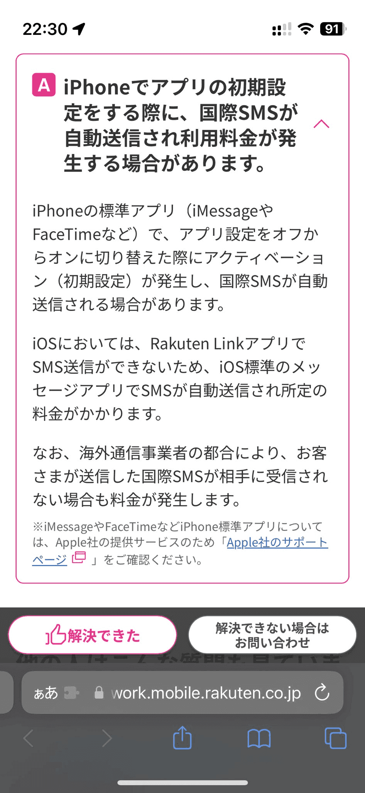

## tl;dr

海外で楽天モバイル回線を使用したままiPhoneを機種変更すると、100円×N回の国際SMS料金が請求されるようになりました。

## 詳細

iPhoneを機種変更するときに、iMessage/Facetimeのアクティベーションに失敗し続けることがあります。

特に楽天モバイルでは、楽天回線の圏外でiMessageなどのアクティベーションをしようとすると失敗することが観測されてきました。

アクティベーションがうまくいかない時iPhoneの仕様上 +44 の番号へSMSが自動的に送り続けられます。

ところで、海外で楽天モバイルを使う際、iPhoneだとSMSの送信や標準電話アプリでの電話の送受信で料金がかかります。

以前はこのアクティベーションのSMSは料金がかからなかったようなのですが、今年4月に機種変更をした際に2カ月遅れで謎の調整金という費目で1月後れで請求されるようになったようです。

この仕様はFAQにも書かれており、サポートに問い合わせてもこのドキュメントが出てくるだけです。

調べても、ウェブの情報は海外では楽天モバイルが良いという情報しか出てこなかったので、備忘録として書き残しておきます。

2023年8月からpovoが海外ローミングをできるようになったようです。海外での番号維持及びSMSでの多要素認証には(eKYCのハードルを除くと)povoが一番よさそうです。

