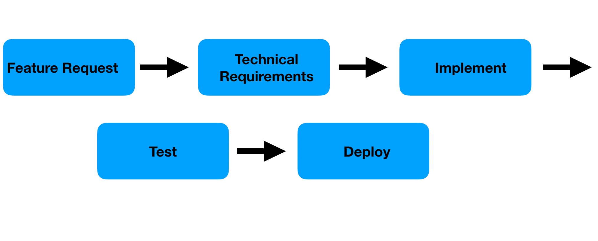
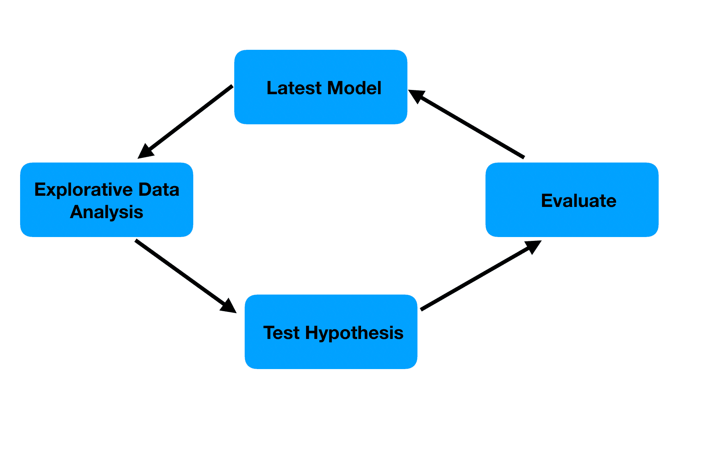

機械学習プロジェクトをいくつかこなしてきたが、直感的にはスクラムが機械学習に向いていなさそうというのを思っていた。が、社内で議論をしたときに「Technical Storyを使えばタスクを2週間に収まるように分割できるはず。そして、それをすれば2週間で価値がでるはず」と言われて、ちゃんと反論ができなかったので世の中ではどういう取り組みがあるのかも含めて、言語化するためにこの記事を書いている。

## disclaimer

著者はMLの経験は長いが、別にスクラムに詳しいわけではなく、開発メンバーとしていくつかのプロジェクトに参加したことがある程度である。

## 調査方法

- Gemini 2.5 Pro (experimental)とブレスト
  - [チャットログ](https://gemini.google.com/share/e761866427d0)
- Redditを中心に体験談を調査

## 想定していた課題

MLプロジェクトでは、iterativeな開発が必ず発生する。これは特に途中で探索的なフェーズ（EDAやモデル開発）が必ず挟まり、総じてそれらのフェーズは手戻りが発生する。

こうした手戻りが高確率で発生するのに対して、「2週間で顧客価値を出す」sprintとの相性はすこぶる悪いと思っていた。

## Technical Storyを使う

Technical Storyとはなんぞや。色々と調べてみたけれど、この記事の冒頭の例がしっくりくる。

[Feature Injection and handling technical stories](https://lizkeogh.com/2008/09/10/feature-injection-and-handling-technical-stories/)

> As a developer,
> I want an automated build
> So that I can be sure my code works.

実際にこういうstoryをちらほら見かける。

なのだけど、上記の記事ではビジネス価値（business benefit, 顧客価値と同義だと認識している）はどこにあるのか？ということを考えたときに、以下のようなテンプレートに落とし込んでビジネス価値を確保し、またfeatureを埋め込めばよい、という主張である。

> In order to <deliver some business benefit>
> <these people>
> will need <these features>.

これを経由して、さらにブラッシュアップするとこうなる。

> In order to <deliver some business benefit>
> As a <role> I want <some other role>
> to <do something, or use or be restricted by some feature>.

> In order to stop bots from spamming the site
> As a member of the commercial team, I want users
> to fill in a captcha box.

めでたしめでたし。本当に？

## MLプロジェクトにおけるビジネス価値

MLプロジェクト、およびMLプロダクトにおけるビジネス価値は、顧客に何かしらの良い影響を与える何かを提供することであることには変わりない。

何か良い精度のモデルが学習できたら、即時顧客価値が提供されるわけではなく、実際の本番環境に予測結果をサービングできるようにして、初めて顧客に価値を届けることができる。あるいは、予測結果をもとにした分析結果をまとめて、アクショナブルな提案をレポートにまとめてプレゼンすることかもしれない。

翻って、こうした顧客価値を数日～2週間のチケットで提供できるか？というと結構難しいと思っている。往々にして、モデルを開発しているタイミングでは、デプロイ先がなかったりすることもある。

一つの方向性としては、Geminiが言うように「リスク削減や不確実性の低減をsprintゴールとする」という発想である。直接的な顧客価値ではないが、ビジネス価値はたしかにある。「この特徴量が予測に効きそうだ」とか「このアルゴリズムはこの問題には不適当だった」などの知見を得られただけでも価値はある。そう考えるのである。

しかし、なぜ2週間にフィットさせるのが難しいのか？こうした疑問にヒントを与えてくれたのが、[Agile Data Science with R](https://edwinth.github.io/ADSwR/index.html)だった。

## タスクレベルの開発フローの違い

[5.1 Linear and Circular Tasks](https://edwinth.github.io/ADSwR/a-methodology-for-agile-data-science.html#linear-and-circular-tasks)では、以下のような図をもとに、典型的なソフトウェア開発と、MLでの開発のタスクの進み方を比較している。

曰く、従来型のソフトウェア開発では、タスクレベルで見れば、タスクの進行が直線的であるのに対し、MLプロジェクトではタスクが循環的であることが多い。（以下の図はともに[Agile Data Science with R](https://edwinth.github.io/ADSwR/index.html)から引用）

従来型のソフトウェア開発での直線的なタスクは、言い換えるとプロジェクトを完了させればよい「完了型」のタスクだとも言われている。

もちろん、MLプロジェクトでも従来型のソフトウェア開発のような直線的なタスクもある。例えば、データインジェスチョンパイプラインや基本的な前処理、デモ用の[streamlit](https://streamlit.io/)でのアプリ開発、予測用のAPI開発などである。

一方で、探索的・実験的なタスクは、データ理解・仮説立案・検証という作業を繰り返す循環型のプロセスである。何が難しいのか。2週間のsprintの中で、予測精度が向上する保証はないので何もコミットができないのである。

## MLプロジェクトでのスクラムを実践する方法

ではどうするのか？そうは言ってもトップダウンで2 week sprintが降りてきたから、どのように実践していくかを考える必要がある、という方もいるかもしれない。

Redditでの議論をいくつか眺めていると、以下の2つのアプローチがあった。

### 1. スクラムをやめてKanbanを使う

いきなり身もふたもない話であるが、agileな開発をするのに何もスクラムをworkflowとして採用するのが必須ではない。

Agile Data Science with Rでも[3.3 Scrum vs Kanban](https://edwinth.github.io/ADSwR/agile-methods.html#scrum-vs-kanban)でこういった指摘がされている。

> Both methodologies are applied with great success and it’s important to keep in mind that they are a means to an end, not religions. The Agile values and principles should be the primary guideline and when selecting one of the workflows you do so because it is the best way to work in an Agile way because its the best fit for the given situation.

ScrumかKanbanかは信仰ではなく、目的を達成するためにチームが最適なもの選び、それが最適かをモニターするのが大事、という指摘である。

著者の会社では、スクラム経験豊富な人も多かったため当初スクラム採用したが、モデル開発でうまくいかなくなり、結局Kanbanに移行したという話がある([12.3 Moving to Kanban](https://edwinth.github.io/ADSwR/case-study-building-the-valuecheck.html#moving-to-kanban))。

理由としては、スクラムは厳格すぎて探索的・実験的フェーズでは柔軟性が低いことがあげられている。またデータも見ないで性能向上にコミットもできないのは先述した通り。そのため、story pointをつけるよりtime boxingの方ががいいという指摘がある。

> Scoping for data science is then not just estimating how long a task will take to complete, it is also time boxing. If used in this way, the scoping should be done in time units, not in a subjective measure such as story points. The data scientist should not take longer for the task than the team agreed upfront, wrapping up even when he does not feel completely finished.

DSは納得いくまで実験をし続ける傾向にあるので、終了条件を厳密に決めるより、時間で区切った方が良いというのは研究フェーズでは合理的である。

実際には、以下のような6つのレーンを持つKanbanを採用したようである。ただし、いくつかのタスクでは仮説検証段階でモデルの精度が上がらないことを確認して終了することもあったそうだ。

- to do
- test hypothesis
- code review hypothesis
- update model
- code review update model
- done

まったく同様の指摘（Kanbanを使え、time boxingをしろ）は[Redditでも見られる](https://www.reddit.com/r/MachineLearning/comments/eqzdup/comment/ff07qkm/)。

> Don’t confuse agility with solely scrum and its sprints, which are the root of the problem and work poorly in research mode.

この具体例なんかはわかりやすい。

> Example: build a PoC in a week. If AUC exceeds X then it’s promising and let’s spend another 3 months on further extensions (data, features, architecture, hyperopt) and putting all into production. If there was no AUC gain on the last week, we do not extend any further. Inside this 3 month time box - execute pure Kanban, task by task, which allows you to take different paths as needed (agility), not waiting till your sprint finishes in 3 days. You already know your new feature is poorly designed and you need to start on tweaking it right now.

つまり、time-boxingをして、その中で仮説検証をしてうまくいったら続きをやる、という意思決定をしていくのである。

また、もう一つのポイントとして、MVPの代わりにMVM (Minimum Viable Model)をさっさと作ること、というのを Agile Data Science with Rの著者は提案している。例えば、最初は線形回帰などのシンプルなモデルを限定したユーザーにMVMとしてデプロイ、次いで特徴量を追加し、最後により複雑なモデル(本文中ではRandom Forestが挙げられていたが今ならNNベースのアプローチもあるだろう)をデプロイする、というような流れである。

これは先のtime-boxingとの話ともつながるが、無数の選択肢の中から確度の高い道を探して枝刈りする取り組みの一つとして、MVMをフックにするのはいいアイデアだと思う。

### 2. Hypothesis Based Storyを使う（スクラムに手を入れる）

別の[Redditのスレッド](https://www.reddit.com/r/datascience/comments/wwi7cs/comment/illoety/)では、スクラムとKanbanを組み合わせるというアプローチがあった。長期的なプロジェクトではスクラムを採用し、リサーチタスクではtime boxingを使用しているというものである。

特に、スクラムに対して以下のような変更をしたようだ。

- hypothesis based stories (instead of user based)
- foregoe stand ups, people keep their tickets as research logs and @ people when they need help. - Product owner can read the tickets if they want to know where we are
- monthly retro rather than per scrum, wider focus
- tickets largely written by the data scientists then priorities by product owner

仮説ベースのstoryを書く。スタンドアップをやらないで、チケットにリサーチログを書く。手助けがいるときはチケットでメンションする。Product Ownerは自分から情報を取りに行く。チケットはデータサイエンティストが書いて、優先順位はProduct Ownerがつける。つまり、DS/MLEに自分の仕事に集中してもらう、ということである。

特に、Hypothesis Based Storyはユニークである。なぜなら、先ほどのTechnical Storyにビジネス価値の話を思い返すと、MLにおける仮説検証フェーズでのビジネス価値は「リスクを低減する、不確実性を下げる」としか書きようがないからである。また、「仮説を立てて検証をする」こと自体をチケットのゴールにすることで、「ちゃんとした仮説を立てないといけない」という意識が生まれ、結果は「仮説が正しかった/間違っていた」ということでcloseできる。

> The point is that the exit criteria is provable and the delivery is typically the proof. Likewise, disapproving the hypothesis is still a success, we learned something.

storyの例も併せて紹介しておこう。

> “We believe a fine tuned distilbert architectures will allow us to identify cases with a precision of greater than .95 and a recall of greater than .7.”

> “We believe it should be possible to transform a given article within our dataset to our standardised form without additional datasets or augmentation”

> “We believe x metric can best be explained to stakeholders using a combination of shap values and distribution charts”

## 余談: MLプロジェクトでProduct Ownerは何をするのか

余談ではあるが、Product Ownerがチケットを作らないのであれば何をするのか、ということについて詳しく書かれた章がある。(5.6 The Product Owner Role)[https://edwinth.github.io/ADSwR/a-methodology-for-agile-data-science.html#the-product-owner-role]

まとめると

- Stake holderとのコミュニケーションを一手に引き受ける。DS/MLEにはタスクにfocusしてもらう
- DS/MLEの作ったタスクについて議論をしてscopingを通じて整理をするのを手伝う
- DS/MLEの作ったタスクを優先順位付けする
- DS/MLEの気づかないビジネス側の懸念点を指摘する

といったところである。

読んでいると、DS/MLEの時間はSWEよりも価値が高いように書かれているように感じる。

## まとめ

ざっと調査してみたが、以下のような結論に至った。

- 厳格なスクラムはMLプロジェクトには向いていない
- 研究・探索フェーズと開発フェーズでworkflowを分ける
- 研究・探索フェーズでは、story pointではなく時間で区切る
- 研究・探索フェーズでは仮説検証を軸に進める（Hypothesis Based Storyを書く、Kanbanを使う）

time boxingの考え方と仮説検証を中心に調査タスクを進めていくというのは、MLプロジェクトにおいては当たり前であるが非常に強力なサポートとなるだろう。

では、冒頭の「Technical Storyを使えばタスクを2週間に収まるように分割できるはず。そして、それをすれば2週間で価値がでるはず」という言葉に対する返答としては、

- ビジネス価値は「不確実性の低減」という理解をする
- Technical StoryよりもHypothesis Based Storyを使うか、Kanbanに移行する
- 2週間という枠で具体的なゴールを決めるよりも、時間で区切って可能性の枝刈りを素早く回していく

ということになるだろう。
