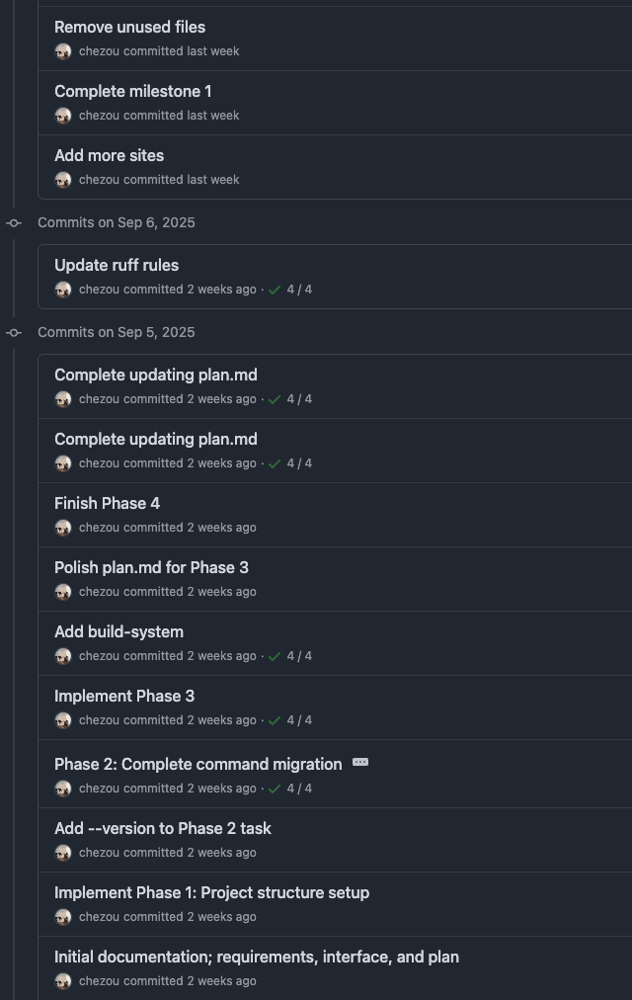

今年に入ってやたらレビューの時間が増えた。これはコードもそうだしドキュメントもそうだ。 そして、これによる疲れも急激に増加している。

もちろんこれは、LLMによる支援によってアウトプットの速度と量が増加したからだ。 そして、必ずしも質が向上しているわけではなく、むしろ下がっているように感じる。 当然、自分の生産性も下がっている。

自分の頭をダンプし、どういう課題があるか、そして、どう向き合っているかを書いていこうと思う。

## 他人を経由したプロンプティング

私は、機械学習のプロジェクトのテックリードとしてしばらく働いている。 その仕事として、[Engineering Requirement Documents](https://sybridge.com/how-to-write-an-engineering-requirements-document/)などの技術文章を書くことも多いが、レビューする機会も多い。

機械学習で難しいのが、プロジェクトが変わり解く課題がちょっと変わると、がらりと全然違う知識が必要になり、新規に論文を読む必要が出てくる。

今までずっとRailsでwebアプリケーションを作っていた人が、ある日突然「Rubyだから同じでしょ」とRubyのパーサージェネレーターの仕様のドキュメントをすっと渡され、すべて生成AIで生成されているのはなんか見てわかるがどうそれをレビューするか、真っ当な仕様になるよう意見するかという問題を想像してみてほしい。 きっと、おもむろに他言語の実装を読むなり論文を読むなりして脳内にインデックスを作ったうえで、レビューをすることになるだろう。

そういう世界観でレビューをする仕様というのは、本当にしんどく、こちらが生成側より知識がある状況に持って行くまで一苦労、そして適切なコメントを繰り広げると待っているのが、すべて生成AIで作られたコメントで反論され、また修正もドラスティックに今までのコンテキスト無視で大規模に上書きされるのである。

こうした状況を、私は「他人を経由したプロンプティング」と表現しているのだが、はっきり言って自分が論文読みながらLLMと議論したほうが手っ取り早いことがほとんどである。

「LLMが生成した文章は、LLMにレビューさせればいいじゃない」と思う読者もいるかも知れないが、これは難しい問題をはらんでいる。じゃあ、そのLLMによるレビューの正しさを誰が担保するのか？という問題である。 自分でLLMと対話をしても常々感じるのが、「[LLMはコンプガチャ](https://tech.dentsusoken.com/entry/2025/08/27/%E5%AE%9F%E7%94%A8%E5%93%81%E3%82%92%E4%BD%9C%E3%81%A3%E3%81%A6%E6%8E%A2%E3%82%8B%E7%94%9F%E6%88%90AI%E3%82%92%E4%BD%BF%E3%81%A3%E3%81%9F%E3%82%BD%E3%83%95%E3%83%88%E3%82%A6%E3%82%A7%E3%82%A2%E9%96%8B#%E3%83%AA%E3%83%95%E3%82%A1%E3%82%AF%E3%82%BF%E3%83%AA%E3%83%B3%E3%82%B0%E5%9C%B0%E7%8D%84%E3%81%A8%E3%83%97%E3%83%AD%E3%82%BB%E3%82%B9%E6%95%B4%E5%82%99%E3%81%AE%E4%BA%8C%E9%80%B1%E7%9B%AE%E4%B8%89%E9%80%B1%E7%9B%AE)」であるということである。出てくる出力は一貫性がなく、同じ質問を3回繰り返すと3回違うことを結構言ってくる。どうするかというと、その傍らで論文や既存実装、ドキュメントを調べて、どれが尤もらしいかを自分で選ぶ必要がある。

今のLLM・生成AIは人間の能力の限界がすべてを規定すると信じているのだが、proxyたる間に入った人はproxyを貫く限りは必要がなくなるので、適切にマネージャーにエスカレーションをする必要がある。

なお余談だが、LLMで生成した文章は、特定の単語が高頻度で出てくる、[em dashが突如出てくる](https://www.reddit.com/r/ChatGPT/comments/1fx12q1/is_an_em_dash_proof_of_ai_manipulation/)などで検出されることも多いが、英語が第一言語ではない民にとっては第一言語特有のクセの有無で見抜かれる、ということもままあるので、きちんと生成された結果には自身を持って自分の意見として他人に渡すようにしよう。

## 自己レビューの欠如、あるいは目が滑る問題

前節でも書いたが、生成したものを自己レビューをしないというケースは往々にしてある。これはただただ不信感を増やすので今すぐやめたほうがいい。 しかし、自己レビューをしても目が滑ってしまうというケースも多いのが実情である。

マネージャーとの1:1で教えてもらったが、同一人物であっても自分が生成させたコードのレビューは甘くなり、他人の生成したコードのレビューは厳しくなる傾向があるらしい。わかる。

なぜこれが起こるかと考えたときに、自分の手で書かないコードは往々にして自分の脳内キャッシュに乗らないのである。それに、Claude Codeでコードを生成させていると、diffをいちいち見るのはかったるくなるようなUXになっている。なので、auto approvalモードで一通り動くものを生成させて、それをレビューすることになる。が、まあ、大量に変更されたときには細かいところの理解は追いつかない。そして、なんかunit test通ってるからOK、となりがちなのである。

## クソデカコミット

最近、ほとんど1コミットで +10,000 -7,000 みたいなPRを受け取った。ビッグバンコミットPRである。

LLM、特にAuto approvalモードでコードを生成すると、agentが試行錯誤を大量にする。そして、agentic codingの特徴として、大きな塊をガンガン上書きする。同一人物が手で書いていたときにはリスペクトしていた既存の設計は、LLMが生成したPRではかなり無視されていた。

[複雑なコードをLLMは生成しがち](https://arxiv.org/html/2501.16857v1#S4.F4)、という研究がある。大きい複雑な変更をするのは、[LLM側には人間にわかりにくいコードを生成してnegative feedbackを回避するインセンティブが働いているという論文の話](https://arxiv.org/html/2409.12822v3)を読んだが、まあそうだよねという気持ちになった。

あとは、タスクを適切な単位に切り出すのはLLMは勝手にはやってくれない。こちらで丁寧に指示しないとなかなか難しいと感じている。

なお、機械学習のような探索的な実装のときに、適切な粒度のコミットをするのはすごい難しいというのは普遍的な問題であるのは、オープンクエスチョンのままだ。

## 生成側とレビュー側のインセンティブ構造の違い

「LLMを使うとコーディングの生産性があがった！」ということを主張したい人は多く、多くの人々がAIによる生産性改善を強く信じており、それができないといけないというハイプが来ているからだと理解している。

で、コードを生成するスループットについては、様々な議論があるのは認識しているが、上る可能性はあると思う。なんだけど、レビューする側は特に速くなることはまだない。全部LLMにレビューを任せるにはもうちょっと（最低一年くらい？）かかるだろう。それに、生成する人がLLM（他人）が生成したコードをレビューするのは今までにはなかったフェーズである。一手多くなるのはコストである。

そうすると、目が滑って自己レビューが甘くなったけど大量に生成されたコードが増えてくる。 つまり、生成側は生成スループットを上げることを最大化し、レビュー側はそんなことはお構いなしに質を担保しなければならない。 このインセンティブ構造の違いが、レビュー疲れの主原因だろう。

## コーディングレビューでの向き合い方

じゃあ、どうしているか。正直銀の弾丸はまだ見つかっていないが、色々と試行錯誤をした結果を共有したい。

### 1\. 生成側がGitHubで他人のコードとしてレビューをする

これは自分も過去に大きめコミット(+700とか)のPRをやらかした反省から、最近は実装時にローカルのVSCodeで毎回LLMが生成したコードをレビューしてapproveするのに加えて、GitHub上でPRをdraft状態でレビューするようにしている。

こうすることで、自分の中でのマインドセットがレビュワーモードに切り替わり、色々とだめな点を見つけることができた。

当たり前に見えるが、レビュー専用のviewを使うというのは、他人のコードレビューと同じメンタルモデルになるのが良いのだろうと思う。

### 2\. ドキュメントドリブンで開発をする

[KopiというJavaのバージョンマネージャーを開発した話](https://tech.dentsusoken.com/entry/2025/08/27/%E5%AE%9F%E7%94%A8%E5%93%81%E3%82%92%E4%BD%9C%E3%81%A3%E3%81%A6%E6%8E%A2%E3%82%8B%E7%94%9F%E6%88%90AI%E3%82%92%E4%BD%BF%E3%81%A3%E3%81%9F%E3%82%BD%E3%83%95%E3%83%88%E3%82%A6%E3%82%A7%E3%82%A2%E9%96%8B)で、いくつか参考になる取り組みがなされていたので、それを自分も試してみた。

私がこの記事と実際のコミットから学んだ重要なポイントは、以下の3点である。

*   人間が作業をして30分くらいで実装できるタスク粒度をLLMに必ず与えること（contextがあふれるため）
    
*   要件定義→外部設計→作業計画の流れ
    
*   さらには上記のドキュメントを一緒にコミットする
    

非常に重要なポイントとしては、要件定義書、外部設計書、作業計画書、（＋受け入れテスト）をドキュメントとして実装とともにコミットすることで、コミットが多少大きくなっても意図が人間に理解しやすいという点である。 また、作業計画をきちんと整理することで、適切な粒度の開発とコミットをLLMの手綱として用意できるのである。これがないと30分程度の

試しに自分も社内ツールとして書いていたスクリプトをOSS化することで、この方式を試してみた。

OSS化するときに社内向けのコードを調整するためにちゃんとしたコミットをお見せすることはできないが、大まかには以下のような流れで作業をした。 （GitHub Copilot + Sonnet 4）

1.  まず、やりたいことをAgent modeでSonnet 4と議論して、[docs/requirements.md](https://github.com/chezou/petit-cli/blob/1d966199195d1fb02d97445e70d3e82d532dc095/docs/requirements.md), [docs/interface.md](https://github.com/chezou/petit-cli/blob/1d966199195d1fb02d97445e70d3e82d532dc095/docs/interface.md)に整理をする。
    
2.  さらにやるべき実装のTODOリストをPhase毎にチェックボックスでリストを作らせて、[docs/plan.md](https://github.com/chezou/petit-cli/blob/1d966199195d1fb02d97445e70d3e82d532dc095/docs/milestone1/plan.md)として保存する
    
3.  これらのドキュメント及び開発のお作法、ツールセットなどを [AGENTS.md](https://github.com/chezou/petit-cli/blob/1d966199195d1fb02d97445e70d3e82d532dc095/AGENTS.md) に作成させる
    
4.  Phase毎に実装をして、コミットをする。その際にplan.mdのチェックをしてコミットをしていく。
    
5.  次のPhaseに移る際にはagentのコンテキストをclearしてAGENTS.mdとplan.mdを読ませて作業をさせる
    
6.  予定していたPhaseが終わり次のマイルストーンに移るときは、 `docs/milestone1` というフォルダを作り、 `plan.md` を移動、 `docs/plan.md` は空のファイルにして新規マイルストーンを開発開始する。
    

OSSとしての実際のPRは以下のような感じである。

[PRの例: Milestone 2](https://github.com/chezou/petit-cli/pull/1)

正直、コミット粒度は大きくて機能がいくつかまとまってコミットされているが、やろうと思えばチェックボックス一個単位でのコミットもplan.mdを管理しているため容易にできる。

つまり、設計レベルで大きな問題がないかをドキュメントで理解できるのが良い点である。もし、設計がまずっていたら、実装を読まなくてもそこに立ち返って議論ができるので、不毛なレビューも回避しやすいと考えている。

## 文章レビューでの向き合い方

正直わからん。同僚が言っていた「LLMが生成した文章を盲目的にそのままスルーしてくる人は、みのもんたがワイドショーで言ってたから真実！と言ってくる人と変わらないよね」というのがしっくりくる。

生成文書をproxyしてくる人に対しては、エスカレーションの文言をLLMに作らせて適宜エスカレするのが良いというのが自分の経験上唯一の対策である。日本語で逐一問題となるデータポイントを列挙して、まとめてもらう。元来要約はLLMの得意分野だし、アメリカ企業によってチューニングされたモデル（Gemini）は、アメリカ式フィードバックの方法にチューニングされている。

## まとめられない

色々と課題とそれに対して行ってきたことを書いてきたが、正直今も手探りである。 しかし、基本的にはLLMの限界はそれを使う人間の限界であるため、その人間の能力をどうすれば最大限に活用できるのか、ということを主眼に人間がワークフローを作っていく必要がまだまだあるだろう。