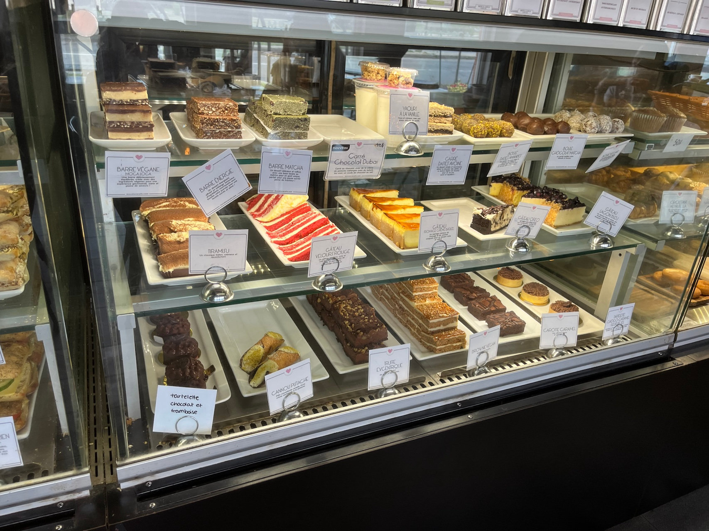
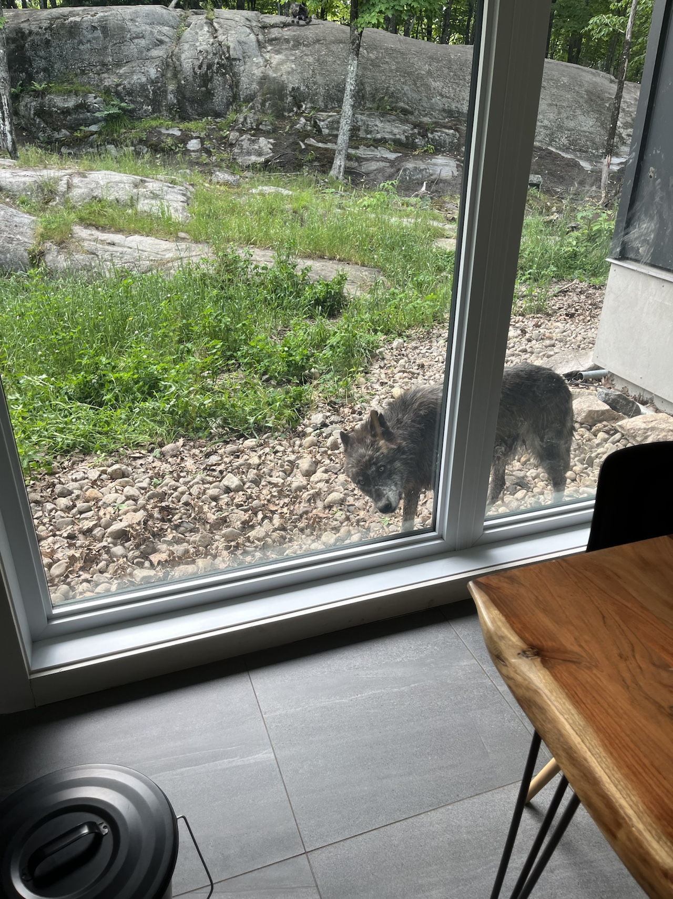
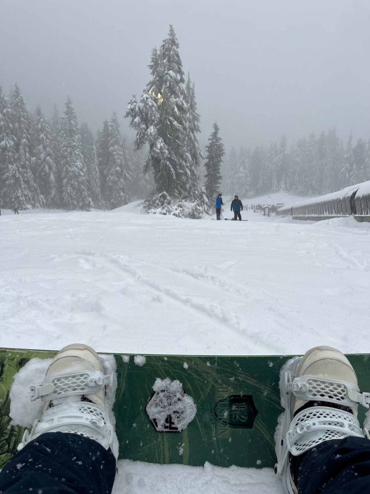

2025年は記憶が薄いので完全に忘れる前に記録しておこうと思う。

## プライベート

今年は引っ越しをしたのでめっちゃバタバタした。それに伴いDIYで家の修繕をしまくった。家の3割くらいの壁を塗りなおしたり、家じゅうの天井のライトを交換しまくったり。後残りの修繕個所は、[Furnace](https://en.wikipedia.org/wiki/Furnace_\(central_heating\))と呼ばれるセントラルヒーティングの暖房の交換と乾燥機の排気管の交換、洗面所のボウルと天板の交換くらいか。まだまだ道は長い。

夏休みにはオタワにも行った。オタワはケベック州と川向なので、フランスの文化の色が濃い。パンやケーキに対する執念が違うため、どこのお店のケーキも程よい甘さでおいしかった。やはり、激アマケーキはアメリカの文化なんだなあというのを再認識した。

オタワに行ったついでに、オオカミがガラス張りのリビングから見えるParc Omegaにも行った。夜通し遠吠えが聞こえるなど、動物好きの人にはたまらない環境だろう。ハイシーズンはめっちゃ高いけど、一泊だけするのでも楽しいと思う。朝ごはんもつけるとケベックのおいしいパンなどが楽しめるのでお勧め。

[https://www.parcomega.ca/](https://www.parcomega.ca/)

今年は完全にスノーボードに転向をして黙々と練習をしている。まだまだ初心者コースもまともに滑れないけど、来年こそは中級コースが滑れるようになりたい。

## 仕事

ここ2年くらいは、Tech Leadとして機械学習のプロダクトを作るためのロードマップ策定からチーム作り、果てはCTOなどのエグゼクティブへのスポンサー継続のための活動などずっと続けている。

ようやく今年は新しいML基盤を本番投入できたし、幾つかのMLソリューションを顧客提供ができた。とはいっても自分はメインでコードを書くことは基本的にはしておらず、チームメンバーに委譲をするというのをこの1年半弱は辛抱強くやっている。チームビルディングも仕事のうちの一つと思って、モチベーションの維持ができるタスクのアサインや、心理的なブロッカーを取り除いたりなんかもやっている。

ML仕事をしているのに全社トップダウンでスクラムが導入されることになったので、[調査したりも](https://chezo.uno/post/2025-05-02-ml-project-and-scrum/)した。未だに全くうまくいってないので、皆がどうやっているのかが気になっている。

年の途中でエンジニアリングディレクターが代わったりして大変だったけど、今はなんとかやっている。あと少しでメンバーが一通り揃ってやりたいことができるようになるのだが...。

Agentic coding全盛なため、ミーティングやランダムな割り込みだらけだったところでもコードが生成できるようになったのは大きな変化だったが、[自分がクリティカルパスにならないように気を付け](https://chezo.uno/post/2025-12-09-2025-12-09-principal-engineer-in-the-gene-of-ai/)たり、[ノールックAI生成物の打ち返し業が増えたり](https://chezo.uno/post/2025-09-19-review-fatigue/)といろいろ歯を食いしばった一年でもあった。

## OSS活動

今年は仕事で使っているOSSのPRを二個作ったのと、必要に迫られてforkしてCUDA 12.x対応したりしていた。

*   [https://github.com/aminalaee/sqladmin/pull/945](https://github.com/aminalaee/sqladmin/pull/945)
    
*   [https://github.com/MobileTeleSystems/RecTools/pull/298](https://github.com/MobileTeleSystems/RecTools/pull/298)
    
*   [https://github.com/chezou/pm-implicit](https://github.com/chezou/pm-implicit)
    

uvxが便利そうなので小物社内ツールを公開したりもした。

*   [https://github.com/chezou/petit-cli](https://github.com/chezou/petit-cli)

RのパッケージのリリースもLLMの助けを借りてできるようになったのは良かった

*   [https://github.com/treasure-data/RTD](https://github.com/treasure-data/RTD)

## 買ってよかったもの

[ZWILLING Enfinigy Kettles Pro 1.5L](https://amzn.to/4p7Eb03)

温度設定ができる電気ケトル。保温機能付き。こちらで使っていた安いケトルとは比べ物にならないくらい速くお湯も沸くし、温度設定ができるのは日本のポット以来なので助かる。難点はカナダで買うと温度がファーレンハイトで書かれていること。しかし、日本の商品は60, 70, 80, 90, 100と書いてあって、そうだよね、、、という気持ちになる。

[APCのUPS](https://amzn.to/4qoU7w4)

引っ越してから6時間以上停電することが2回、3時間程度停電することもちらほらあって、今年は外れ年だなと思いながらUPSを買い足したのだが、無線ルーターとプロバイダのモデムが2時間持ったのはとても助かった。ついでにAnkerの大きいバッテリーも買ってUSB PDから5V2Aのケーブルに変換できるやつも買ったので、次回はトータル8時間くらいはインターネットができそう。

## 来年に向けて

今年は、アニメを見たりB'zのライブ動画を無限に見て正気を保とうとしていた。ゲームをやる気力がわかないので、もうすこし運動を増やして体力を増やしていきたい。
