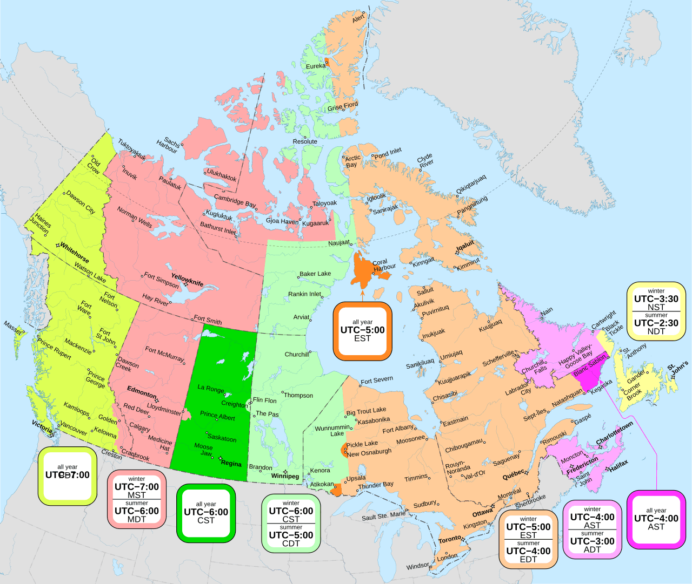

会社のボランティアデーというのがあるので、何がいいかなと思って色々とClaudeと話したところ、Wikipediaの[カナダ時間](https://ja.wikipedia.org/wiki/%E3%82%AB%E3%83%8A%E3%83%80%E6%99%82%E9%96%93)にBC州のタイムゾーンが「太平洋時間」に変わるという発表を受け編集したのを思い出したので、それ関連の改善をした。

これは、2026/3/2に唐突に発表された[夏時間を恒久化する](https://lifevancouver.jp/permanent-daylight-saving-time-in-bc)話に基づいて、Wikipediaの太平洋時間という新しい「タイムゾーン」の話を更新したのだが、今日ふらっと見てみるとカナダ時間のページのBC州の項目が山岳部標準時の下の太平洋夏時間という表記になっており、うーんなんじゃそりゃとなったので、[Time in British Columbia](https://en.wikipedia.org/wiki/Time_in_British_Columbia)の日本語訳をした。

成果物は、[ブリティッシュコロンビア時間](https://ja.wikipedia.org/wiki/%E3%83%96%E3%83%AA%E3%83%86%E3%82%A3%E3%83%83%E3%82%B7%E3%83%A5%E3%82%B3%E3%83%AD%E3%83%B3%E3%83%93%E3%82%A2%E6%99%82%E9%96%93)を見てほしい。（ついでに太平洋時間の記述を、[ブリティッシュコロンビア時間をリンクすることでカナダ時間にも復活させた](https://ja.wikipedia.org/wiki/%E3%82%AB%E3%83%8A%E3%83%80%E6%99%82%E9%96%93#%E5%B1%B1%E5%B2%B3%E9%83%A8%E6%A8%99%E6%BA%96%E6%99%82)）

## ハマりどころ

Wikipediaの存在しないページを翻訳するのは今回初めてだったのだが、色々とハマった。

1. LLMの翻訳をそのままは当然駄目
2. 公式翻訳ツール「コンテンツ翻訳」は英日ではなんの訳にも立たないし、なんなら邪魔
3. Pacific Timeはタイムゾーンなのか論争

1に関しては、機械翻訳について結構ちゃんと[削除規定](https://ja.wikipedia.org/wiki/Wikipedia:%E5%89%8A%E9%99%A4%E3%81%AE%E6%96%B9%E9%87%9D#%E3%82%B1%E3%83%BC%E3%82%B9_G-3:_%E6%A9%9F%E6%A2%B0%E7%BF%BB%E8%A8%B3%E3%81%AE%E6%BF%AB%E7%94%A8%E3%81%8C%E7%96%91%E3%82%8F%E3%82%8C%E3%82%8B%E8%A8%98%E4%BA%8B)がある。このケースG3のリンクにある表現は一昔前の基準ぽいが、こういうことが書かれており、問題を避けるために自分で翻訳をした。

>    - 以下のような記事は、機械翻訳が翻訳のベースとされているという事実により、百科事典の記事として正確性の問題が発生する可能性がある誤訳が含まれていることが推定されるため、削除の対象となります。
>        - いずれかの機械翻訳の出力結果と完全に一致する文が記事に多数残されていたり、「ですます調」の修正などの翻訳文の微修正にとどまっていたりする場合。
>        - いずれかの機械翻訳をベースにしつつ人の手が加えられているが、誤訳または日本語として不自然な文章が残されている場合。

2はケースG3からもリンクされているんだが、翻訳エラーが出るだけならまだしも、原文を転写することもできない。一度翻訳を転写するという規定を選んだが最後、空のブロックを作成しようとすると自分でやった翻訳も消える。多分、一からページ作るほうが速い。

## Pacific Timeは山岳部標準時なのか、そもそもタイムゾーンなのか論争

この[Time in CanadaのTalk](https://en.wikipedia.org/wiki/Talk:Time_in_Canada#Pacific_Time)を見てもらうとわかるのだが、どうも自分が翻訳したブリティッシュコロンビア時間のもととなったTime in British Columbiaというページは Pacific Time (British Columbia)という名前だったようだ。

Talkをみると、UTC-7は山岳部標準時と呼ぶべきである派閥がPacific TimeはUTC-7なのでMSTの下に入れようとしている。類似例としてサスカチュワン州は通年UTC-6なので[中部標準時(CST)の下に区分されている](https://en.wikipedia.org/wiki/Time_in_Canada#Central_Time_Zone)。

<a href="//commons.wikimedia.org/w/index.php?title=User:Mappify&amp;action=edit&amp;redlink=1" class="new" title="User:Mappify (page does not exist)">Mappify</a> - 投稿者自身による著作物, <a href="https://creativecommons.org/licenses/by-sa/4.0" title="Creative Commons Attribution-Share Alike 4.0">CC 表示-継承 4.0</a>, <a href="https://commons.wikimedia.org/w/index.php?curid=185512650">リンク</a>による

つまり、UTC-6は夏時間であれば山岳部夏時間（MDT）、そうでなければ中部標準時（CST）と表記すべきという話である。同様にして、UTC-7通年のPacific Timeは山岳部標準時（MST）と表現されるべきという主張である。

だが、BC州民としてはBC州の法律で[Pacific Time](https://www.canlii.org/en/bc/laws/astat/sbc-2019-c-41/199250/sbc-2019-c-41.html)という呼称は制定されており、その名称を無視するのはいかがなものかと思うわけである。

[Time in British Columbia](https://en.wikipedia.org/wiki/Time_in_British_Columbia#History)にも書かれる、BC州首相のDavid Ebyの言葉と、その翻訳を持って締めようと思う。

> British Columbia premier David Eby decided to make the switch before the US due to poor relations between the two countries since the second Trump administration began, saying British Columbia should "stand on our own two feet as a province in relation to everything, including time zones".

> ブリティッシュコロンビア州のデビッド・イービー首相は、第2次トランプ政権の発足以来の米加関係の冷え込みを受け、米国に先駆けて時間帯を変更する決断を下した。イービー首相は、「時間帯の問題を含め、あらゆる面において、ブリティッシュコロンビア州は州として自立した姿勢を貫くべきだ」と述べている。
