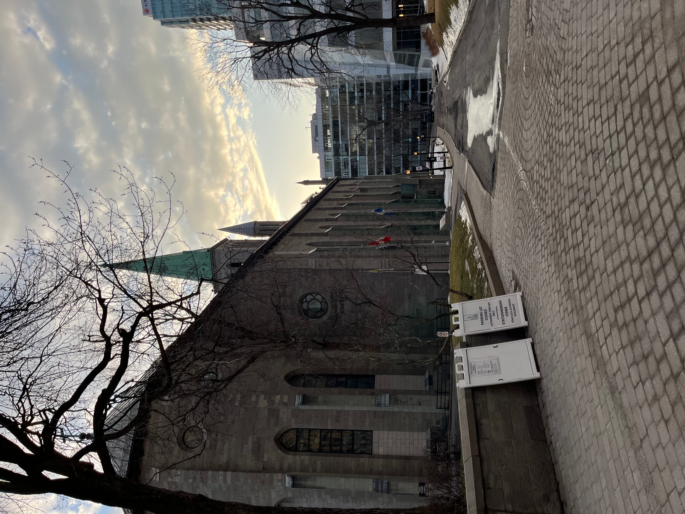
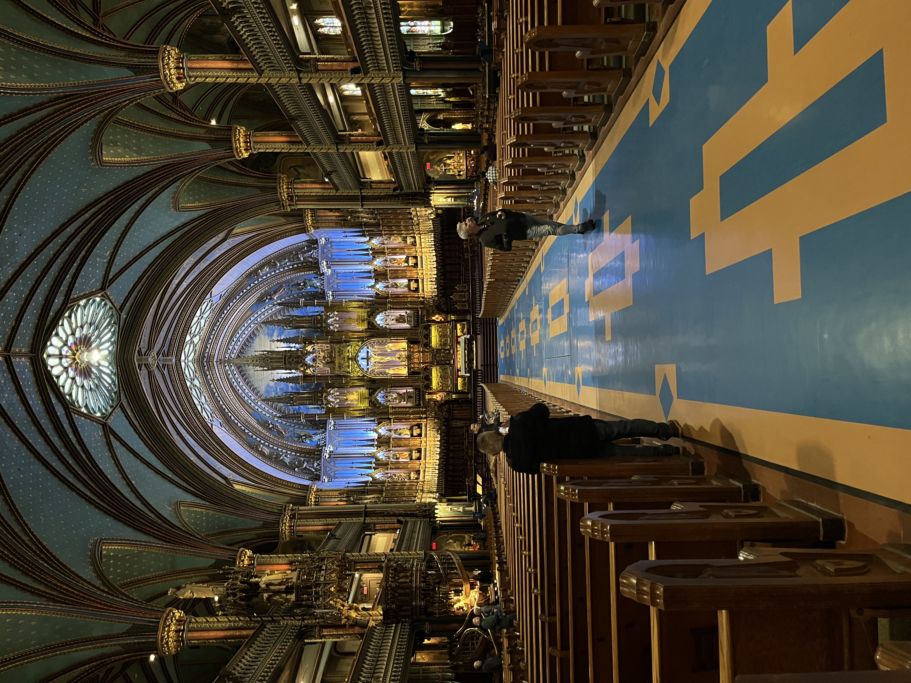
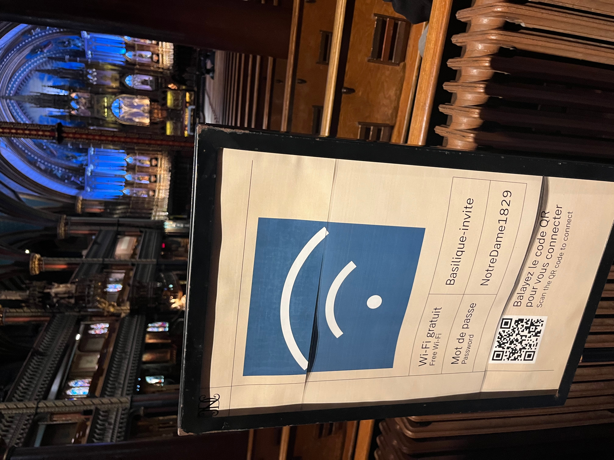
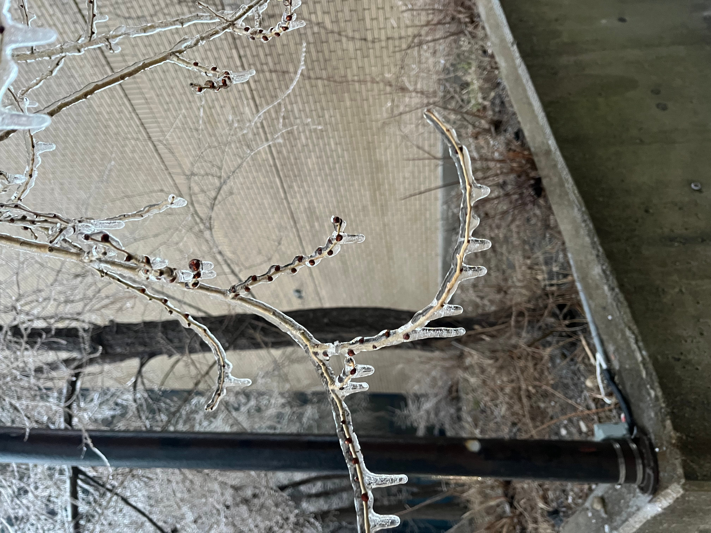
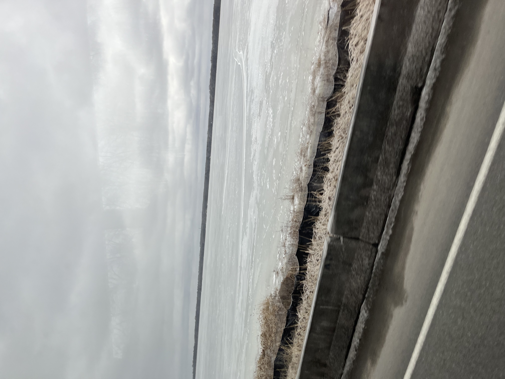

3月の上旬にworkationとして友人を訪ねがてらMontréalとOttawaに数日行ってきた。

Vancouver近郊に住んでいるため、東海岸の春はどんなものかと思いながら行ったわけだが、3日いる中であったかくて寒いという東海岸らしい寒暖差を体験した。体感14℃の春の陽気から、体感-10℃のfreezing rainで学校が休みになるという差の激しさは驚きだった。

")

初めて行ったときに比べて変わったのは、自分の年齢とDuolingoで学び続けたカタコトのフランス語力、生きていくには困らない程度の英語力だったわけだが、Vancouverに5年も住んでいると大きな驚きはあまりなくなっている。

街の感じは、良くも悪くもヨーロッパを感じた。石畳の上をスーツケース引っ張るのが大変なのはヨーロッパっぽいし、街並みに突如と現れる石造りの教会が多いのもそうだ。カフェに入ったらパンもお菓子も美味しいのはフレンチのこだわりを感じて良い。なんだけど、街行く人の歩きタバコも多く、バス停の屋根の下でタバコ吸って占拠してる人、それに伴うゴミに溢れる街並みを見ると、ドイツを思い出した。

今回は、友人に教えてもらってBounceを使って荷物を預けたのだが、それはとても良い体験だった。モントリオール中央駅近くのカフェに預けたので、深夜便で空港から移動をして朝ごはんをゆったり楽しむことができた。Bounceは参加しているホテルやカフェなどの施設が荷物を預かってくれるサービスなのだが、自分が預けたところは従業員しか入れないところに置いてくれており、安心感も高かった。[リファラルコード](https://bnce.us/refer-friends?coupon=BOUNCE-1J04MJBWY&friend=Aki)置いておくのでよければどうぞ。 

フランス語初学者としては、Montréalで注文をするのはフランス語の練習にちょうどよい。"Je voudrais un café au lait ... with oat milk"なんてチャンポンに嫌な顔せず受け止めてくれた。

Montréalの街並みは昔の記憶よりもコンパクトで、ノートルダム聖堂を始め多くの道で工事をしており、[construction seasonが始まった](https://www.reddit.com/r/polandball/comments/1goqeg/the_four_seasons_of_canada/)のを感じた。しかし、聖堂でフリーWiFiが提供されているのを見たときは時の流れを感じた。YVRでApple Watchのバンドが壊れかけているのに気づいてぶらぶらとApple Storeまで散策をしたのはなかなか良かった。Apple Storeはだいたい目抜き通りにあるので、その年の中心部を散歩する口実にはちょうどよい。

宿はローカルのところがいいかなー、と、ケベックの会社が運営している host-me.ca という会社で民泊を予約したのだが、本当に酷い体験をしたのでマジでおすすめしない。お値打ちな宿をGoogleが「host-me.caが大元です」と出したので、Claudeに相談しながらも駄目だったら話の種になるわーと予約を取った。

が、チェックインのための鍵のコードが待てど暮らせど来ない。事前にearly checkinか早めの荷物預け入れができないか問い合わせた時についでに聞いたら「チェックイン24時間前までには送ります」とメールで言っていたにも関わらず来ない。前日の夜空港で（フィリピン等の外部委託の）サポセンに電話で問い合わせたら「お前のクレカの決済が通っていない」と言い始め、当日朝空港についたあとで、メールと電話で「約束のサービスが提供されないのでクレカのチャージバック依頼するからもう泊まらない」と言った直後に電話がかかってきて「今システム登録したから」「24時間前じゃない、24時間以内だ」「夜遅くに問い合わせされても無効だ」などと嘘や言い訳を並べ立ててきた。結局、当日ホテル取り直すよりは安いということでそのまま泊まったが、問い合わせ対応で過ごす空港のラウンジは過去一番時間が経つのが早かった。

宿自体は小綺麗でさっぱりしていたが、いかんせん[Ho-Ma](https://en.wikipedia.org/wiki/Hochelaga-Maisonneuve)という再開発エリアのため、夜一人で歩く自身はあまりない感じだった。周りに店も多くないので、観光客向けのエリアではない。なので安いんだなと改めて実感した。

翌日はOttawaの友人夫妻の家を訪ね泊めてもらった。Ottawaのブリュワリーも良かったし、友人宅でいただいたMalawi料理のNsimaも美味しかった。freezing rainもice stormも何のそのということで行き帰り無事過ごせたのは良かった。

二都市をふらっと行って思ったのは、なんだかんだOttawaのほうが好きだなあということ。Montréalは思っていたより大都会で、3路線乗り換える地下鉄があるくらいである！もう人の多いところは無理なのだなあと思いVancouverに戻り雪山を堪能したのであった。またOntarioは行きたいものである。
