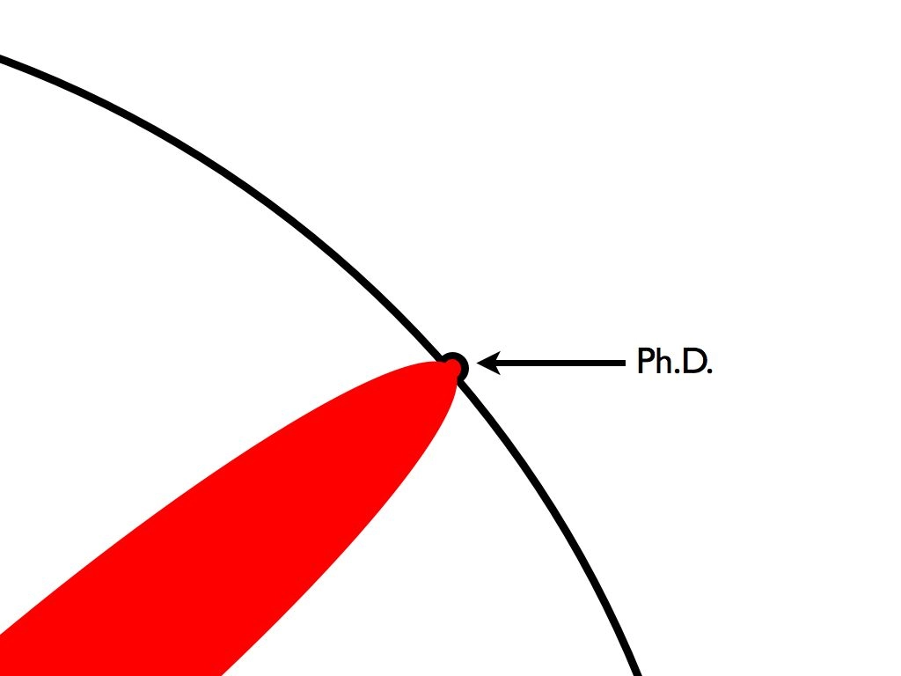

2026/3/31付けで7年半務めたTreasure Dataを退職します。

### 過去記事

- [Treasure Dataに入りました]([https://chezo.uno/post/2018-10-19_treasure-data-------plazma-tech-talk-------3c901d92e973/](https://chezo.uno/post/2018-10-19_treasure-data-------plazma-tech-talk-------3c901d92e973/))
- [退職します]([https://chezo.uno/post/2018-06-19_goodbye-cloudera/](https://chezo.uno/post/2018-06-19_goodbye-cloudera/))
- [転職しました]([https://chezo.uno/post/2016-03-30-zhuan-zhi-simasita/](https://chezo.uno/post/2016-03-30-zhuan-zhi-simasita/))

## 原初のMLチーム（傭兵期）

入社したのはArm買収直後のタイミングでした。最初は3人しかいない当時CTO（元CEO）直下の遊撃部隊としてのMLチームからはじまりました。前職[Cloudera](https://chezo.uno/post/2018-06-19_goodbye-cloudera/)ではSales Engineer（AWSで言うところのSA）だったので、実はSWEに戻るための転職活動は結構大変でした。（TDから声をかけていただいたLeoさんには感謝）

ただ、その中でも面接でプロダクト志向がとても強い[takutiさん](https://takuti.me/ja/note/td-to-amazon/)との出会いがTDの入社の決め手だったのを今でも覚えています。そして、その直感は正しく、[pytd](https://github.com/treasure-data/pytd)の開発なんかで一緒に働くのはとても楽しいときでした。彼とは今も友人関係として良くしてもらっています。

この時代は、顧客のMLキャンペーンのお手伝いをさせていただいたり、Custom Scriptと呼ばれるPythonをTreasure Workflow（TDのhosted digdag）上で動かす機能のPythonがまともに動くようなML use case及びそのサンプルコードを作ったり、顧客ミーティングに飛び入りで売り込みをさせていただいたりと、遊撃部隊ならではの幅広い活動をしていました。顧客ミーティングにスライド持っていってデモして売り込んだのは、まだまだ小さい組織だったのもありますがCloudera時代の経験が生きた瞬間でした。

## AudienceチームでのCDP開発（一人一殺時代）

CTOのArmでの活動が増えてきて、MLチームが維持できないという話になり、CDPを開発しているAudienceチームに移籍する話になりました。その時、海外で働きたいという話を再度上司であったCTOにしたところ「TDを通じて海外で活躍できるエンジニアを増やしたい」とVancouverへのrelocationを快く応援していただいたのは、とても感謝しています。

仕事としては、CDPの画面を新しくするのに伴って、フォルダ構造を取り入れるためのプロジェクトで各種機能の実装をRailsでしたり、サーバーサイドKotlinでRealtime ID Stitchingを実装したけど出なかったりといろいろとやりました。一人一殺と言われていた時代です。

幸いなことに、Vancouverで北米西海岸にいるPdMやUXデザイナーと一緒に仕事する機会も多かったです。Clouderaで英語に多少自信をつけておいたのでガッツで乗り切りました。（そもそも、TDの人々がnon nativeの英語に寛容なのが大きい）

このとき、Rubyコミッターでもあるnaruseさんとkaneko.yさんのチームで働き始めたのですが、その後もずっと社での戦略的な振る舞いをどうするかのアドバイザー的なことをずっとしてもらい、大変お世話になりました。この二人の現状認識と議論、ツッコミは今思い返しても良い訓練になりました。

特に、なんかわからんけどうまく行かない、という状況をメタに整理して、「なぜこの人はこのようなことを言っているのだろう」という「筆者の気持ちを推測する」ことを無限に繰り返していたのですが、これが非常に後々まで役に立つスキルとなりました。何かしらの矛盾している声明が出たときに、昔であればともすれば感情的に「何いってんだ？」と反発するようなことを思ってしまったのですが、今では「ああ、これはこの人も混迷を極めており、助けを求めているのだなあ」と判断できるようになりました。

これは、僕が割とエンジニアとしてはempathyを強めに感じてしまう方なのですが、彼らは現象とその背後にある論理を徹底的に言語化するということに長けており、ある種感情を理詰めで理解するという営みだったと思います。社会性を模倣から獲得することで伸びたスキルなのかもしれないとも思いますが、僕には足りていない要素だったので、他では得難いスキルを得ました。

また、kaneko.yさんと退職前に反省会をしたときに、「丸くなりましたね」と言われて、ふと人に動いてもらうためにどう言葉をかければいいのか、というのを仕事では使えるようになっていたのだな、と思いました。（家庭ではよく怒られが発生するのでまだまだなんだとは思います）

naruseさんがkaneko.yさんをEMラダーに移るよう説得したときの「正しいものを作るには、それをできる力を自分で得る必要がある。」という言葉は、後のTech lead業をするに当たって都度都度振り返った言葉でもあります。Principal業は割と境界をどう押し広げるか、ということの繰り返しだったことが大きいです。

途中でチーム再編があり、Vancouverで一人他は全員東京メンバーになったときにも、ex-Cookpadのよしみでinohiro氏を社内から引き抜いてきたりと、チームを安定化するのにも貢献できたのは良かったです。

## 2回目のMLチーム

2年半くらいMLプロジェクトのTech Lead業をやっていました。MLプロジェクトのエンジニアリングをリードとして何でもやる係を任され投入されたのですが、なんだかんだでMLチームを作っていく仕事も任されるようになりました。最初は、チーム所属を変えないでSr Eng Directorと密にやりながら進めていったのですが、紆余曲折ありMLチームを直接率いる事になりました。

そのあたりは以下の記事でも書いたとおりなので、よければ見てください。

[Principalと器用貧乏のあいだ]([https://chezo.uno/post/2026-03-07-2026-03-08-between-principal-and-glue-work/](https://chezo.uno/post/2026-03-07-2026-03-08-between-principal-and-glue-work/))

自分が骨を砕いたのは、いかにMLという力を使って顧客価値を出していくのかということでした。[プロダクトエンジニアとして](https://chezo.uno/post/2016-03-30-zhuan-zhi-simasita/)、それを実現するためにあの手この手を尽くしました。

結局、MLプロジェクトのリードをするようになって、3回くらいメンバー入れ替えに伴うチームの立て直しをしました。採用はとても重要で、妥協なくやらないとリカバリに半年とか平気で飛ぶというのも学びました。（自分で言うのもなんですが）粘り強く今持っている手札で出来る打ち手を考え続けるということをやり続けられたかと思います。

途中で組織変更があって、レポートラインがSr Eng Director直になったことも、自分のキャリアとしては非常に大きな転換でした。彼のコミュニケーションスタイルはとても粘り強く相手の意図を汲み取るために全力を尽くす、というスタイルで、理解が難しい発言や声明も自分がアクション可能な形へと落とし込む力はとても勉強になりました。

彼はIT業界で長くやっていることもあり、ドットコム・バブルやリーマン・ショックなどの変化を経験してきているわけです。そんな中で、AIによる様々な変化に対してどう向き合ってるか聞いたところ「ソフトウェアエンジニアリングにおいて、新しいパラダイムが来てもいつもすべての問題を解決するわけではない。新しい課題も生まれる。それを解き続けるのがエンジニアリングだ。AIもそうだと思っている」との言葉をもらいました。これは非常に心強い言葉だなと思うとともに、隙間時間でOpenAI Agents SDKを触って自分の業務を自動化したりしてる、という変化に適応し続ける姿勢に裏打ちされているものであるのだと再認識しました。彼の口癖は "We should be prepared for the changes, even if that's a hard change.” （先回りして考えておけることは考えておく。たとえどうしようもない変化でも、覚悟しておくだけで折れずにいられる）というもので、これは僕も強く共感を覚えています。

自分の上司の中でも彼の右腕として働けたのは、とても学びも大きく良かったです。これが、 thought leaderなんだなと感じました。

## 終わりに

7年半と自分のキャリアとしては一社で過去最長の勤続をすることとなりました。そして気がつけばVancouverに来てちょうど5年経ち、こちらで働いた期間のほうが長いのも感慨深いです。

次は明日から相変わらずVancouverから新しい会社で働きます。今度は、AIの世界にどっぷり浸かろうと思います。
