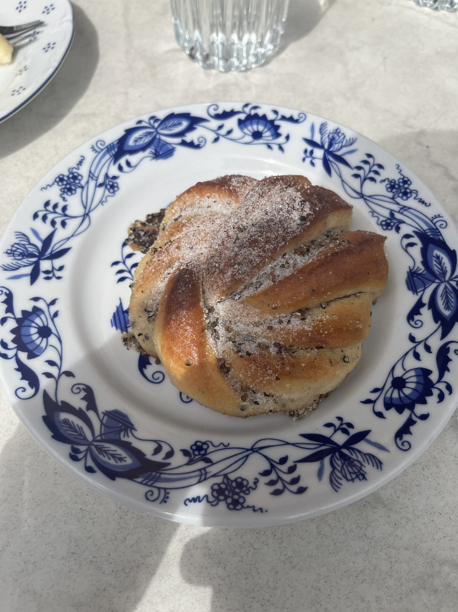
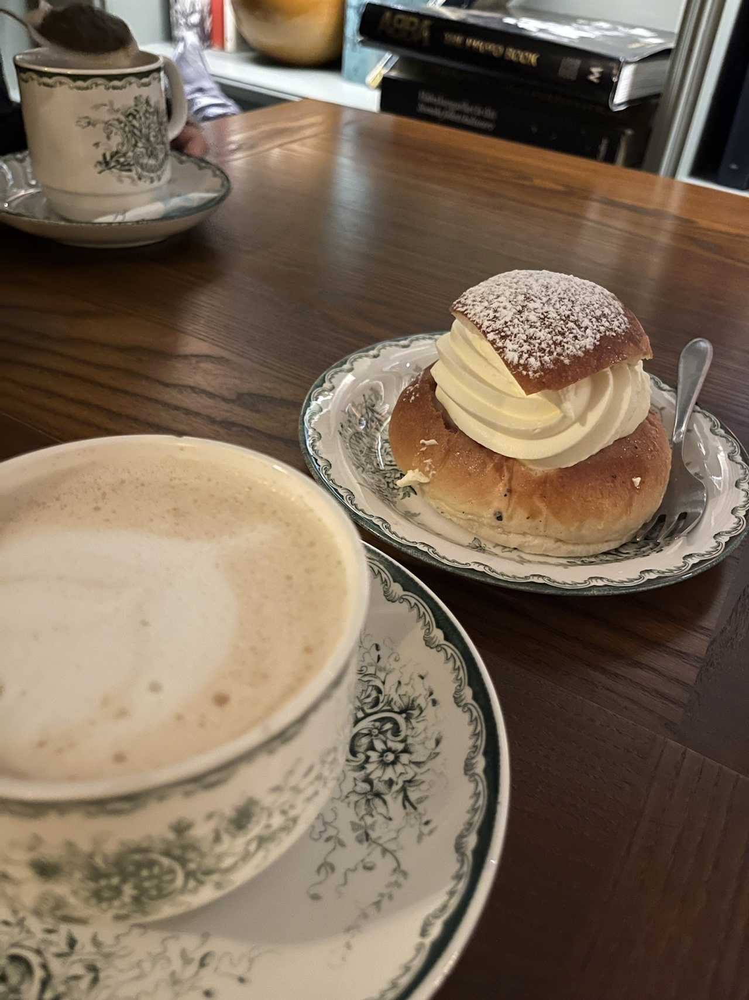
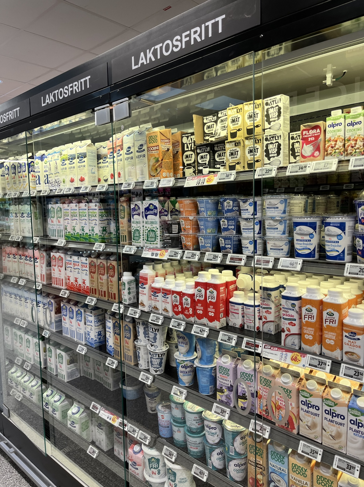
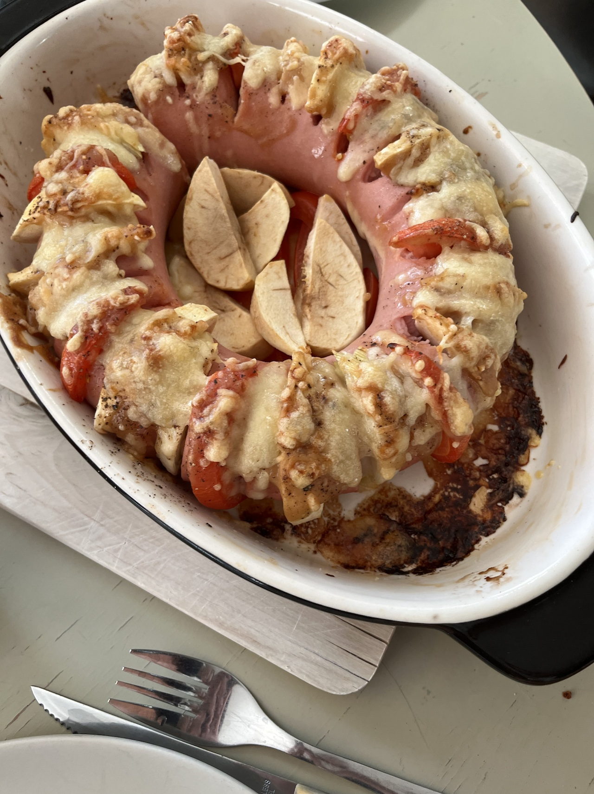
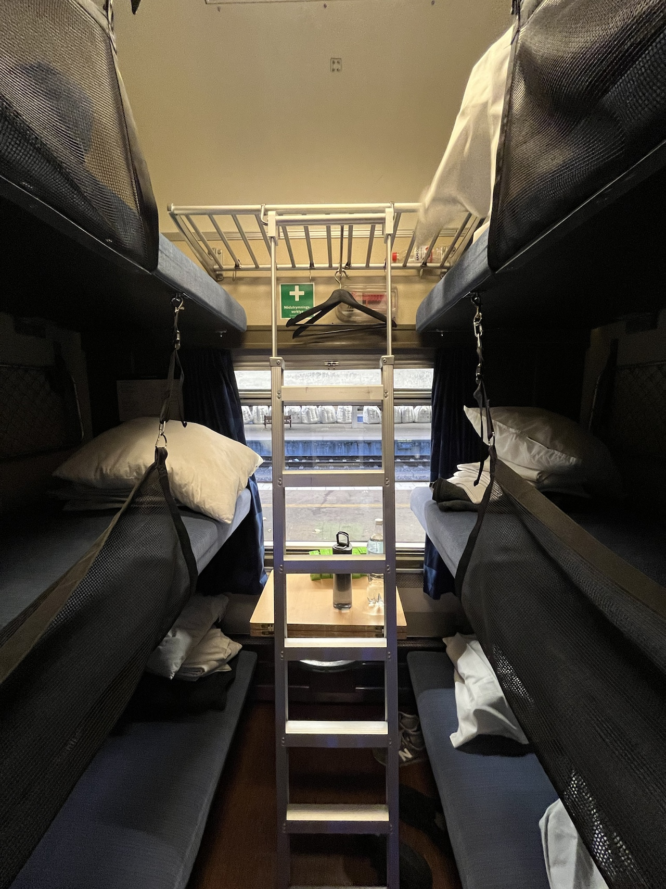
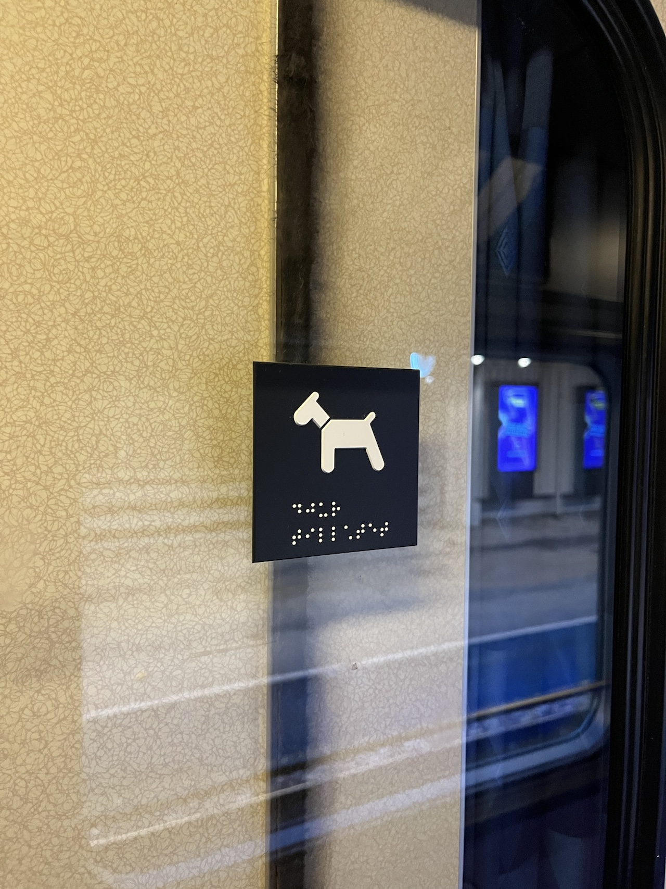

6月末から7月の頭にかけて、家族で北欧はスウェーデンとデンマークに旅行に行ってきた。きっかけは、kwappaさんが[podcast](https://listen.style/p/kwappa)で「いつでも行けると思ったら、色々な事情で行けなくなる。旅は今が一番ベストタイミング」みたいなことを言っていたのを聞いて、よっしゃ、と一念発起して昨年10月に航空券とホテルを手配した。家族全員で国外旅行するのはいつぞやに出張兼で行ったシンガポール以来である。

航空券を手配したときも、うっすらと「ヨーロッパの情勢はいつどう変わるかわからない」と思っていたが、その後様々なことが起こり、サーチャージは高騰し、欧州のジェット燃料が枯渇仕掛けて旅行保険がそれを保険対象外とするなど、様々な事が起こったが運よく大きな問題は起こらかなった。（行きの便が遅延してトロント乗り継ぎがあわや失敗するかというような小さなトラブルは色々あった）

今回は、妻の友人がストックホルム近郊に住んでいるためお隣のソルナという市にホテルを取りストックホルムらへんをぶらぶらしつつ、寝台列車でIKEAの本社もあるというマルメまで移動し一泊、その後橋をわたってコペンハーゲンに行き数日滞在というプランである。

新婚旅行で来たストックホルムは2月真冬ド真ん中だったので、初めての夏の北欧に来たのだが、天気は確かに良く気温も過ごしやすかった。ちょうど到着する前の週と後の週に熱波が来ていたらしく、ラッキーだった。バンクーバーは夏は雲一つないカラッとした晴れ（そして最近は結構熱い）か雨みたいな中間がないのだが、ストックホルムは雲が多少あるがその分過ごしやすい晴れという懐かしい空模様だった。

ソルナのホテルのすぐそばには緑多い公園Hagaparkenがあり、駅前には大きいモールとがあるなんとも住みよさそうな街だった。ストックホルムの中心街までバスで15分くらいと交通の便も良かった。以前はガムラスタンに泊まったが、バンクーバー生活が長いからか、もう観光地のド真ん中で泊まるのはあまり楽しいと思わないようになってしまったかもしれない。それくらい落ち着く街だった。

ストックホルムの食べ物はどれも美味しく、中でもfikaと呼ばれるコーヒー文化が根付いているからか、ケーキにシナモンバンやカルダモンバンも程よい甘さで美味しかった。

季節外れのセムラが食べられたのはちょっとラッキーだった。

驚いたのは、どこのカフェでもホテルでもラクトースフリーミルクが提供されていること。スーパーでは一面ラクトースフリーの冷蔵庫もあったくらい。乳糖不耐の人間としてはとても助かった。なお、これはお隣デンマークに行くと途端になくなったので、スウェーデン独特なのだろう。

友人宅にお邪魔して家庭料理をごちそうになったのも代えがたい思い出だ。友人曰く、「私たちにはとても当たり前のものなので、どれがローカルなのかもはやわからなくて、他にないものと知ったときは驚いた」と言っていたのが印象的だった。

マルメまでの寝台列車は、お世辞にも快適とは言えなかった。旅行では連日朝晩のストレッチを欠かさないようにしていたのだが、足を上げるのも難しく断念した。周りは子連れの4人、5人のグループが結構いて、2等車は賑わっていた。

そうそう、ストックホルムもマルメも至るところに犬がいて、駄目なところはわざわざ犬禁止マークが書かれたりしていた。電車でもバスでもこっちは犬OK（リードに繋いで連れて良い）みたいな区分がされており、バンクーバーでの車のみ犬が許容されているのとは大きな違いだと感じた。

