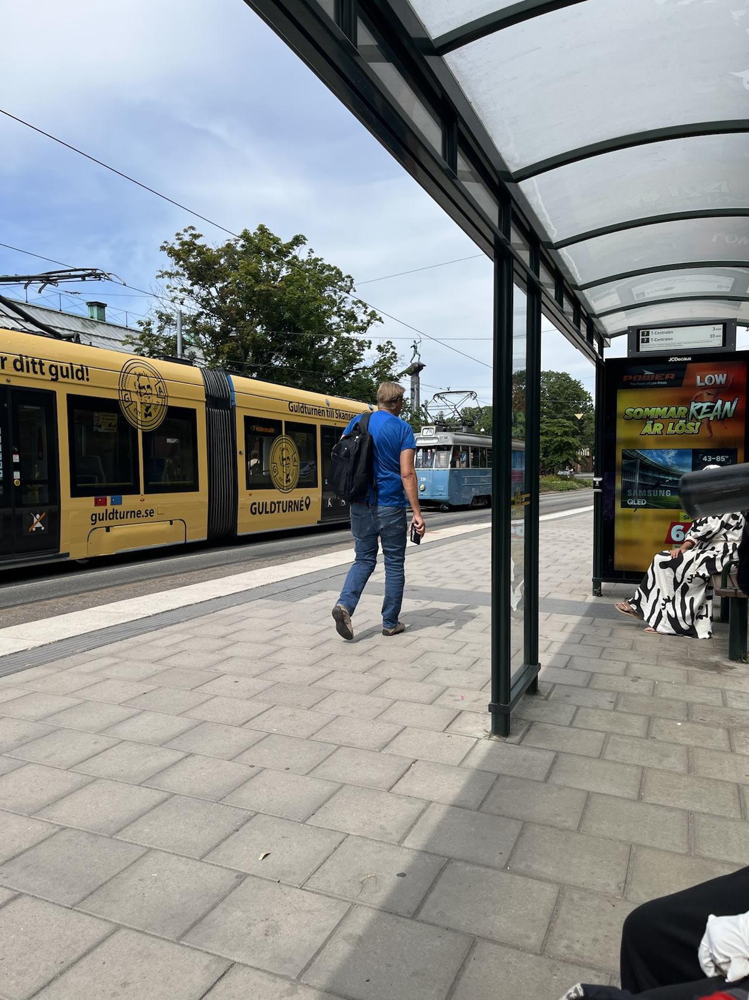

6月末から7月の頭にかけて、家族で北欧はスウェーデンとデンマークに旅行に行ってきた。きっかけは、kwappaさんが[podcast](https://listen.style/p/kwappa)で「いつでも行けると思ったら、色々な事情で行けなくなる。旅は今が一番ベストタイミング」みたいなことを言っていたのを聞いて、よっしゃ、と一念発起して昨年10月に航空券とホテルを手配した。家族全員で国外旅行するのはいつぞやに出張兼で行ったシンガポール以来である。

航空券を手配したときも、うっすらと「ヨーロッパの情勢はいつどう変わるかわからない」と思っていたが、その後様々なことが起こり、サーチャージは高騰し、欧州のジェット燃料が枯渇仕掛けて旅行保険がそれを保険対象外とするなど、様々な事が起こったが運よく大きな問題は起こらかなった。（行きの便が遅延してトロント乗り継ぎがあわや失敗するかというような小さなトラブルは色々あった）

今回は、妻の友人がストックホルム近郊に住んでいるためお隣のソルナという市にホテルを取りストックホルムらへんをぶらぶらしつつ、寝台列車でマルメまで移動し一泊、その後橋をわたってコペンハーゲンに行き数日滞在というプランである。

新婚旅行で来たストックホルムは2月真冬ド真ん中だったので、初めての夏の北欧に来たのだが、天気は確かに良く気温も過ごしやすかった。ちょうど到着する前の週と後の週に熱波が来ていたらしく、ラッキーだった。バンクーバーは夏は雲一つないカラッとした晴れ（そして最近は結構熱い）か雨みたいな中間がないのだが、ストックホルムは雲が多少あるがその分過ごしやすい晴れという懐かしい空模様だった。

