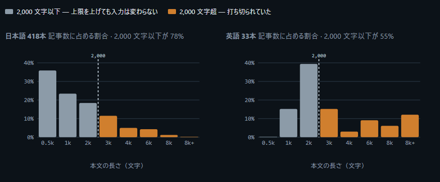

このサイトでは、 [prelims-cli を使って関連記事を自前でレコメンド](https://chezo.uno/post/2022-01-25-hugo-content-based-recommendation/)している。prelims-cliはfrontmatterに色々と情報を付加できる[prelims](https://github.com/takuti/prelims/)をCLIで動くようにしたものである。

実装した当初、embedding modelを使った類似記事推薦をやってみたいと思ったが、当時使ったembedding modelではTF-IDFベースの手法に比べてイマイチな結果しか出なかったため諦めていた。

時は流れ、[ozaさん](https://www.t-oza.net/)に「今どきはCPUでもサクサク動く軽量embedding modelがありますよ」と教えられてGitHub Actionsで動く[embeddingベースのレコメンドを実装した](https://github.com/chezou/prelims-cli/pull/5)のであった。

ruri-v3とgraniteが軽量だが性能が良いと言うので試してみたら、TF-IDFと比較してもレコメンド結果をざっと目視で見ても悪くない結果だったので採用した。なにより、sudachiの辞書をGHAからダウンロードするよりもembedding modelをダウンロードする方が速いのである。

つい先週、seconさんが[Bekko Embedding](https://secon.dev/entry/2026/07/29/080000-bekko-embedding/)という小型モデルをリリースしたという記事を読んだ。これは、ワンチャン日英大統一できないかなー、日英以外もサポートできないかなーと思って、Claude任せに実験をしてみた。三連休の最終日なのに。

それで、出来た実験結果はこちら。

https://claude.ai/code/artifact/d92655d1-8d96-408c-95c3-f80e5e89deb1

簡単に言うと、失敗である。

理由はいくつかあるが

- 自分のサイトのブログ記事の関連に正解データがない
- 代理指標として記事のタグ・カテゴリが同じものを推薦出来るかを見たが、タグ・カテゴリが付与されている数も少なかった
- そんな指標で測ったので、日英両方とも既存モデルに対して大幅な改善は得られなかった（指標の分解能が±5〜7ptで、比べていた差が2pt前後とおよそ誤差レベル）
- むしろ、レコメンドに使う文字列長を伸ばしたほうが、英語は改善した（データをみたら英語のほうが文字数が多い記事が多かった）

定性的にいくつか見比べても悪くはない感じではあったのだが、好みとしても既存モデルの傾向の方が良かったのもある。

- 「homebrewを移動してiRubyが壊れたときに見直すポイント」 (tags: ruby)
    - ruri → 「Pythonの環境構築を自分なりに整理してみる」 (環境構築のトラブル)
    - a25m → 「kawasaki.rb #008 を開催しました」 (Ruby)
- 「新しいPyPIでMarkdownのドキュメントを使う」 (tags: python)
    - ruri → 「prelimsを使ってHugoの記事にレコメンドを追加する」 (tags: python)
    - a25m → 「mecab-python3を捨ててnatto-pyにしよう」 (tags: nlp)

1個目なんかは、環境構築系という意味では似ているなと感じる。2個目もHugoもMarkdownだしね、というので良いかなと感じた。

こうしたことを鑑みて、日英は既存のモデルを維持することとし、他言語も計測できないのに入れてもなーということで諦めた。評価用の正解データがないと比較できないという当たり前の結果になった。Bekkoは速くて軽いのはとてもよいのだけど、a25mは既存のモデルよりは遅くかつ重かった(199 MB 対 ruri 37 MB / granite 52 MB)し、実験を進めるうちにGHAのcache等の改善もした結果、統一しなくてもいいかなという気持ちになってしまったのもある。
