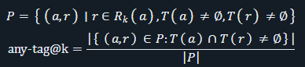
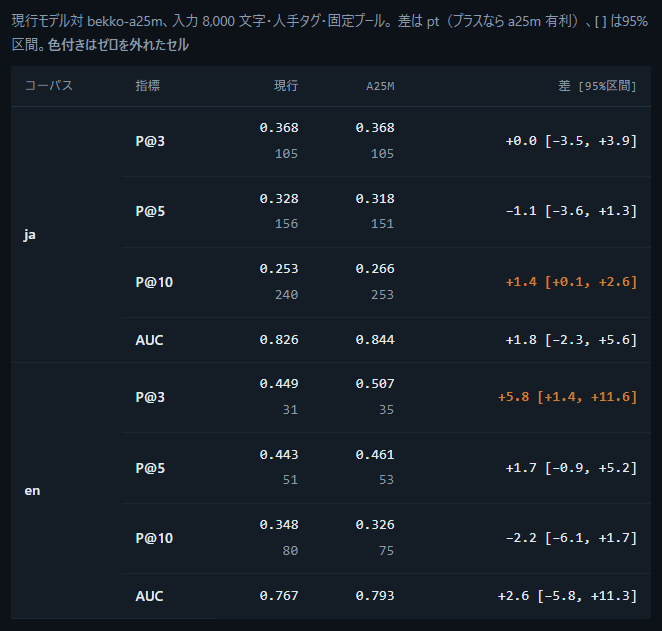
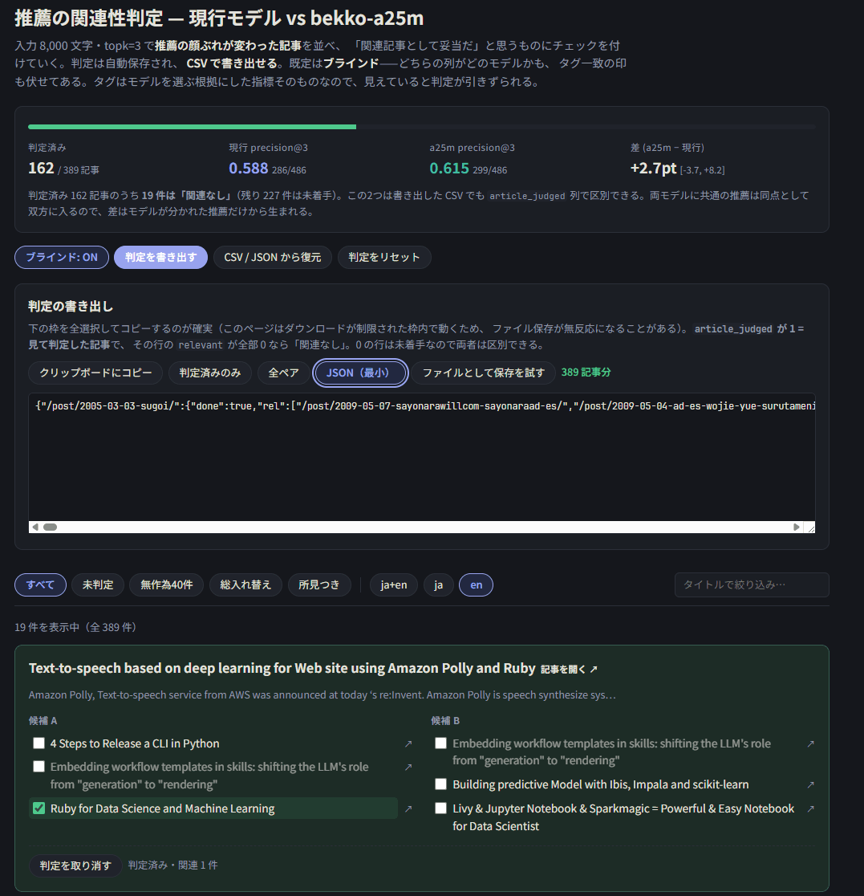
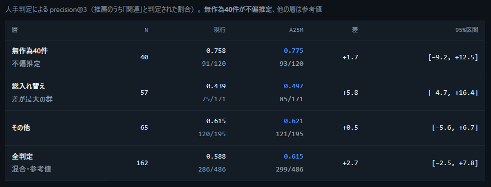

前回の話はこちらにあるので見てほしい

[ブログの推薦用軽量embedding modelをBekkoに変えようとして、変えれなかった](https://chezo.uno/post/2026-08-04-%E3%83%96%E3%83%AD%E3%82%B0%E3%81%AE%E6%8E%A8%E8%96%A6%E7%94%A8%E8%BB%BD%E9%87%8Fembedding-model%E3%82%92bekko%E3%81%AB%E5%A4%89%E3%81%88%E3%82%88%E3%81%86%E3%81%A8%E3%81%97%E3%81%A6%E5%A4%89%E3%81%88%E3%82%8C%E3%81%AA%E3%81%8B%E3%81%A3%E3%81%9F/)

今、このブログではBekko a25mで関連記事が出るようになっている。そこに至るまでの経緯を書いていこう。

最新版のレポートはこちら



### Opus 5が設計する代理指標の罠

正解ラベルのない推薦タスクなため、タグ・カテゴリ一致率という指標をOpus 5が提案した。この代理指標の重大な問題にOpus 5が気づいたため追加調査を行った。

一致率の分母 |P| というのは、推薦された記事に依存して変わるのである。



Bekko a25mは、タグ・カテゴリのついた記事を推薦しやすいという傾向が見られた。なので、再現率が上がり、分母が増えるから一致率が下がるという現象が発生していた。しかも、これをずっとOpus 5はHTMLに補足として書いていたのである！（人もLLMも真面目に読んでいなかった！）

### Fable 5への切り替えとアノテーションツール

これを改善するために、Fable 5に切り替え指標を提案してもらった。今回は、分母を固定する固定プール precision@k とペアワイズAUCを使って比較をした（詳細はレポートを見てほしい）。Top 3についてみると、Bekko a25mのほうが同等か良くなっていた。



しかし、タグ・カテゴリが付与されている記事は限られるし、同じタグがある記事数も限られるということを思い出し、タグの出現頻度分布を見たところ、やはり厳しいだろうとなった。

実際のデータをみないといけないと思い、Claudeに比較とアノテーションのためのツールを作ってもらいブラウザで人手評価をした。ツールでは出力結果に（順位を除いた）差異があったものだけを評価するスタイルになっている。Fableはしれっとactive learningの手法を使ってきたのだ。実は一部出力に対する所見はOpus/Fableにも出してもらっていたが、自分でデータを見ることが大事というのを思い出し初心に帰ったのだ。



389記事中162記事を評価したところで打ち切ったのだが、それを元に評価をし直したところ、信頼区間の下限まで見ると自信はないが、top 3の指標の差は全部非負であった。



LLMから得られた所見も役に立った。

> **The Real Group の新譜紹介** → a25m は**同じアーティスト**の 旧譜レビュー2件を並べる。現行は別アーティストのライブ告知を返した。

> **石田衣良「うつくしい子ども」の書評** → a25m は**同じ著者**の 「アキハバラ＠DEEP」「愛がいない部屋」を並べる。現行は著者一致1件。

> **川崎Ruby会議01 の開催報告** → a25m は**姉妹イベント**の 神奈川Ruby会議を最上位に。現行は毎月のミートアップ報告を返した。

姉妹イベント、よくわかりましたね。著者やアーティストの重なりも見ており良いのでは、という気持ちになった。癖と言うか傾向の違いはあれど実用に足りうると言えるだろう。

ブログ初期はほぼ日記だったので、雑多なテーマが多くタイトルからは想像できない記事も多かった。

遠回りをしたけど、結局は人手でデータを見るのが大事なのであった。

### CIでembeddingする際の技術的なハードルの解決

並行していくつかのGHAのCIで実行するための最適化を行った。

- モデルサイズが大きくなってもCIの実行時間を伸ばさないために、HFのモデルキャッシュをGHAでキャッシュする
- embedding時にメモリ上限に引っかからないために、バッチングを最適化

これらにより、全452記事のembeddingがモデルDL込で3分8秒（キャッシュ利用時で2分51秒）と現実的な時間で動くことが確認できた。実際には、embedding vectorの計算は記事が追加されるごとに差分で実行されるので、もっと速くなる。

つまり、運用上の懸念点がなくなったのである。

こうして、Bekko a25mによる関連記事推薦が採用される運びとなった。

### prelims-cli でBekko a25mを使うには

v0.0.11からBekko a25mを `multilingual` optionを渡すと使えるようになっている。

詳細は [https://github.com/chezou/prelims-cli/pull/15](https://github.com/chezou/prelims-cli/pull/15) のPRを見てほしいが、設定としては以下のように書くだけである。

```yaml
     - permalink_base: "/post"
        type: embedding_recommender
        language: multilingual
        topk: 3
        cache_db: ".prelims_embedding_cache.db"
```

ぜひ、試してみてほしい。感想お待ちしています。
