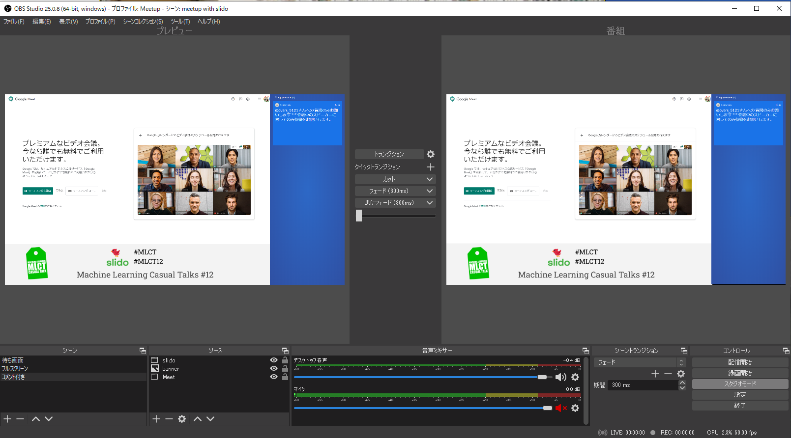

先日、[Machine Learning Casual Talks #12](https://mlct.connpass.com/event/172550/)というイベントの配信担当をした。

会社ではZoomを使っているけど、Google Meetが今なら無料で使わせてもらえるということで、ありがたくMeetで発表をしてそれをYouTube Liveで流すということをした。



ライブでの配信は同時参加者ピークで250名くらいで、配信も一瞬ネットワークの問題で乱れが発生したが、ほかは概ね安定していた。

世の中のイベントの配信情報は、ZoomばかりでGoogle Meetでやっている例があまり見当たらなく、あっても細かいOBSのレイアウトどうしたんだよ！と思っていたので、ここに書いていく。

## tl;dr

* MeetでOBS自前配信はしんどいのでZoomが使えたらそちらを使いましょう
* リハーサルは大事。特に発表者の接続チェックはしましょう

## 構成

Google Meet -> OBS -> YouTube Live

という至って普通の構成。これにsli.doの質問と自作のバナー画像を貼り付けていた。

Meetのエンタープライズプランなら、YT Liveへの配信も楽にできたらしいが、無料なので致し方なし。

## 準備にかかったコスト

今回始めてYouTube LiveをOBSで配信したのだけど、配信事故とかの話もチラチラ聞いていたので、

* 運営でのリハ
* 一人でのOBS設定のチューニングも兼ねたリハ
* 直前のリハ

の3回リハをした。特に2個目のは、画像バナー作成や最適な設定を見つけるまでに試行錯誤して休日ほぼ一日潰してしまった。家族には感謝しかない。

ただ、一度レイアウトを組めば（ウィンドウサイズの調整はいるけど）再利用できそうなので次回以降はもっと楽になりそう。

## 配信の体制

基本的に以下のような体制を敷いた。

* 司会
* 配信オペレーション
* YouTube Live監視 & Twitterなどのコメント

## OBSのレイアウト

左上にMeetの画面を配置し、右側にsli.doのプレゼンテーションモードのウィンドウを小さくしてはりつけ、下側にGoogle Slideで作ったバナー画像を貼り付けた。

sli.doが管理者でなくてもプレゼンテーションモードにできたので、それの横幅を狭めればそれっぽい画面になった。ただ、管理者のときに出てくるものより太いので注意が必要。

テロップはあるといいとは思ったのだが、気づいたのが配信開始直前だったのでやらなかった。

その他のOBSの設定は普通にGPUを使ってnvencを使うことと1080pで出力するところを調整したくらい。あとは、スタジオモードで作業をしたほうが色々とトランジションしやすくて良い。

作ったレイアウトは、

1. バナーとsli.do付き
2. Meetの画面フルスクリーン
3. 待機画面用の画像

の3つを用意しておいた。 特に2はもし1がうまく行かなかったときのために保険として用意をしたが、幸いにして使う必要はなかった。

WindowsでOBSを使ったので、画面から出るMeetの音声をそのまま流して、自分のマイクの音はMeetにだけ乗るようにした。こうすることで、ディレクターっぽい指示をたまに出していた。 なお、物理ノブがあるオーディオインターフェースでマイク音量をコントロールできたのはやはり良かった。

今は色々と在庫がないが、evo4とか安いのがよければWindowsの評判はいまいちだがUM2あたりを持っておくと良い。

<iframe style="width:120px;height:240px;" marginwidth="0" marginheight="0" scrolling="no" frameborder="0" src="//rcm-fe.amazon-adsystem.com/e/cm?lt1=_blank&bc1=000000&IS2=1&bg1=FFFFFF&fc1=000000&lc1=0000FF&t=chezou-22&language=ja_JP&o=9&p=8&l=as4&m=amazon&f=ifr&ref=as_ss_li_til&asins=B084BGC5LR&linkId=581c3b4714ca88bc5e3a97177ed7d623"></iframe>

<iframe style="width:120px;height:240px;" marginwidth="0" marginheight="0" scrolling="no" frameborder="0" src="//rcm-fe.amazon-adsystem.com/e/cm?lt1=_blank&bc1=000000&IS2=1&bg1=FFFFFF&fc1=000000&lc1=0000FF&t=chezou-22&language=ja_JP&o=9&p=8&l=as4&m=amazon&f=ifr&ref=as_ss_li_til&asins=B00EK1OTZC&linkId=eea3ad3397591c34a7826b0714a3ec1b"></iframe>

## Meetならではの気をつけること

以下の4つの注意点がある。

* Meetのレイアウト
* 画像の解像度を上げる
* 発表者の接続チェックは忘れずに
* 音量のノーマライズが暴れるのをなんとかする

### Meetのレイアウト

Meetのレイアウトはデフォルト自動でワチャワチャ変わっていくのだが、見ている方は落ち着かない。今回は右側に顔が並ぶ設定に固定した。ただし、このレイアウトは自分ひとりでテストしようにもできないので、事前のリハで確認したいところ。

あと、発表している人以外はビデオカメラをオフにしてもらったが、リアクションがわかりにくいので登壇者は全員顔を出しても良かったかも知れない。

なお、レイアウトは通話ごとに設定するぽいので忘れないように。 このレイアウトでも、発表者の顔の位置は固定できないので、PinPで発表者だけの顔をOBSで切り出すのは絶望的なのでやめましょう。Zoomだとビデオオンにしてる人だけ写すということができるようなのだが、Meetの場合は顔出しをするためだけの、別のコールをもう一つ作ってそれを切り出してPinPにするのが良いらしい。

### 画像の解像度を上げる

Meetの画像の解像度はデフォルト360pなので、720pに開始後に上げること。そこをよしなにしてくれないのがMeet。忘れないように。

### 発表者の接続チェックは忘れずに

これは、Zoomでも同じかも知れないが、画面共有には罠が潜んでいる。発表者の接続チェックはしたほうがいいだろう。

今回、一人Keynoteだけを共有できずSpeakerDeckで発表するというのを直前に変更せざるを得なかった。 あと、配信者としてはこのタイミングで各自の音量の確認をしておくこと。

### 音量のノーマライズが暴れるのをなんとかする

大体の通話アプリは音量がノーマライズされるのだが、Meetのそれは凶悪。気を緩めるとすぐに音割れをする勢いの音量をだしてくるので、OBSのレベルメータを常に注視して調整し続ける。疲れる。本当に疲れる。 これを避けるために、一度仮想マイクデバイスを間にかますとかいうテクもあるらしいが未検証。

暴れるのは飛影の右手だけで十分。

## 改善点

いくつかやっておけばよかったものとして

- YT Live URLの事前告知 (eventをリハと分けて先に作ればよかった)
- マイクの指導

一個目は知識不足の勘違いからきた。リハ前にイベントを予め作って告知すれば良かった。

二個目は、マイクの最終指導をすればよかった。
コンデンサマイクを持ってても場所が悪いと残響ひどくなる。EarPodsはスレを防止するために止めるおなど。マイクの設置についてはこの動画を見てもらえば良かった。



あと、やっぱりMacBook Proの内蔵マイクは残響がひどくてだめだったので、こちらで買ってでもマイクを用意してもらったほうが良かった。

## まとめ

Google Meetでのオンライン配信、悪くはないけれどいろいろなノウハウがあるのでぜひチャレンジしてほしい。有料のZoomがある人はそちらでやるのがやはり楽だろう。
